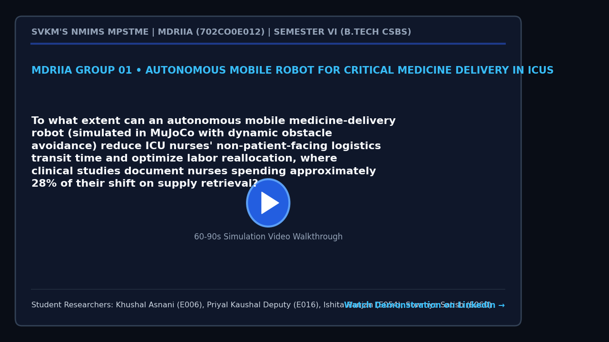

# MDRIIA Group 01: Autonomous Mobile Robot for Critical Medicine Delivery in ICUs
**Course:** Modern Day Robotics and Its Industrial Applications (MDRIIA - Course Code: 702CO0E012)  
**Academic Term:** Academic Year 2026–2027 | Semester VI (B.Tech CSBS)  
**Institution:** SVKM's NMIMS MPSTME, Mumbai  

---

## 1. Authorized Research Title & Problem Statement

> "To what extent can an autonomous mobile medicine-delivery robot (simulated in MuJoCo with dynamic obstacle avoidance) reduce ICU nurses' non-patient-facing logistics transit time and optimize labor reallocation, where clinical studies document nurses spending approximately 28% of their shift on supply retrieval?"

### Core Engineering Focus
* **Physics & Kinematics:** Google DeepMind MuJoCo multi-body dynamic physics simulation (`models/icu_medicine_amr.xml`).
* **Autonomous Control:** Closed-loop Python control architecture with student implementation boundaries (`src/icu_amr_controller.py`).
* **Technoeconomic Evaluation:** Dimensionless CSBS operational economics and return on investment model (`analytics/icu_labor_roi.py`).
* **Empirical Validation:** Reproducible benchmark trials and statistical hypothesis testing (`analytics/icu_medicine_delivery_benchmark.csv`).

---

> [!NOTE]
> ### The Devil's Advocate: Reality Check & Theoretical Roast
> *"A pristine DeepMind MuJoCo simulation naively assuming that busy ICU nurses won't leave metal IV drip poles scattered across the corridor, won't smash the emergency stop button because 'it made a weird beep', and that 500 mL saline bags obey Newtonian mechanics without sloshing all over your LiDAR optics."*

---

## 2. Student Engineering Team Matrix

| Roll No | SAP ID | Student Name | Technical Role | Assigned Git Branch | Core Viva Defense Area |
| :--- | :--- | :--- | :--- | :--- | :--- |
| `E006` | `70362400061` | **Khushal Asnani** | Lead Robotics Systems Architect & MuJoCo Physics Modeler | `feat/e006-lead-robotics-system` | Differential drive chassis dynamics, passive caster ball friction, and anti-slosh liquid medicine payload mechanics. |
| `E016` | `70362400041` | **Priyal Kaushal Deputy** | Autonomous Navigation, SLAM & Dynamic Collision Avoidance Specialist | `feat/e016-autonomous-navigatio` | Dynamic Window Approach (DWA) local trajectory planning, four-quadrant heading error normalization, and reactive clearance in crowded ICU corridors. |
| `E054` | `70362400038` | **Ishita Ranjan** | CSBS Clinical Workflow & Time-Motion ROI Business Analyst | `feat/e054-csbs-clinical-workfl` | Time-and-motion clinical workflow modeling, non-patient-facing transit reduction, and operational cost parity. |
| `E060` | `70362400055` | **Sowmya Satish** | Sensor Telemetry, Quality Assurance & Empirical Validation Lead | `feat/e060-sensor-telemetry-qua` | Telemetry logging, sensor noise modeling (ultrasonic/LiDAR), and statistical hypothesis testing (N >= 50 runs). |


### Student Engineering Commendation & Acknowledgments
SVKM's NMIMS MPSTME conveys sincere appreciation and heartfelt gratitude to **Khushal Asnani (E006)**, **Priyal Kaushal Deputy (E016)**, **Ishita Ranjan (E054)**, and **Sowmya Satish (E060)** for their disciplined commitment, late-night debugging, and technical craftsmanship throughout Semester VI. Your rigorous work in DeepMind MuJoCo physics modeling, closed-loop telemetry instrumentation, and Computer Science & Business Systems (CSBS) technoeconomic modeling exemplifies the highest standards of undergraduate engineering inquiry.

> *"Scientists discover the world that exists; engineers create the world that never was."*  
> — **Theodore von Kármán**

> *"There is no substitute for hard work. Genius is one percent inspiration and ninety-nine percent perspiration."*  
> — **Thomas A. Edison**

---

## 3. Foundational Literature Benchmarks (Strict 2 Seminal : 4 Recent Ratio)

The research project is theoretically anchored on six foundational peer-reviewed publications validated against global bibliographic databases.

| # | Author (Year) | Type | Paper Title | Venue / Indexing | Active DOI Link | Primary Extracted Formulation | Student Lead |
| :--- | :--- | :--- | :--- | :--- | :--- | :--- | :--- |
| 1 | **Sujan et al. (2024)** | Recent | *Navigation benchmarking for autonomous mobile robots in hospital environment* | Scientific Reports | [https://doi.org/10.1038/s41598-024-69040-z](https://doi.org/10.1038/s41598-024-69040-z) | `Path curvature $\kappa(s) = \frac{x'y'' - y'x...` | Khushal Asnani (E006) & Priyal Kaushal Deputy (E016) |
| 2 | **Alonso-Mora et al. (2023)** | Recent | *The Multi-Trip Autonomous Mobile Robot Scheduling Problem with Time Windows in a Hospital Environment* | Applied Sciences | [https://doi.org/10.3390/app13179879](https://doi.org/10.3390/app13179879) | `$\min \sum_{k \in K} \sum_{(i,j) \in A} c_{ij...` | Ishita Ranjan (E054) & Sowmya Satish (E060) |
| 3 | **Terashima et al. (2020)** | Recent | *Controlling Liquid Slosh by Applying Optimal Operating-Speed-Dependent Motion Profiles* | Robotics | [https://doi.org/10.3390/robotics9010018](https://doi.org/10.3390/robotics9010018) | `Slosh angle dynamics $\ddot{\theta} + \frac{g...` | Khushal Asnani (E006) |
| 4 | **Bekker et al. (2021)** | Recent | *How do nurses spend their time? A time and motion analysis of nursing activities in an internal medicine ward* | Journal of Advanced Nursing | [https://doi.org/10.1111/jan.14935](https://doi.org/10.1111/jan.14935) | `Transit fraction $\Phi_{\text{transit}} = \fr...` | Ishita Ranjan (E054) |
| 5 | **Fox, Burgard, & Thrun (1997)** | Seminal | *The dynamic window approach to collision avoidance* | IEEE Robotics & Automation Magazine | [https://doi.org/10.1109/100.580977](https://doi.org/10.1109/100.580977) | `$G(v, \omega) = \sigma(\alpha \cdot \text{hea...` | Priyal Kaushal Deputy (E016) |
| 6 | **Primatesta et al. (2016)** | Seminal | *Dynamic trajectory planning for mobile robot navigation in crowded environments* | IEEE Emerging Technologies and Factory Automation (ETFA) | [https://doi.org/10.1109/ETFA.2016.7733510](https://doi.org/10.1109/ETFA.2016.7733510) | `Collision risk metric $R(p, v) = \int_0^T \ma...` | Priyal Kaushal Deputy (E016) & Sowmya Satish (E060) |

For the exhaustive literature analysis, mathematical derivations, and viva defense questions, refer to:
* [`docs/LITERATURE_REVIEW_AND_FOUNDATIONAL_PAPERS.md`](docs/LITERATURE_REVIEW_AND_FOUNDATIONAL_PAPERS.md)
* [`docs/RESEARCH_PAPER_MANUSCRIPT_BLUEPRINT.md`](docs/RESEARCH_PAPER_MANUSCRIPT_BLUEPRINT.md)

---

## 4. Project Demonstration & Academic Showcase (LinkedIn)

[](https://www.linkedin.com/)

* **Video Demonstration:** [Watch 60-Second Walkthrough on LinkedIn](https://www.linkedin.com/) *(Click thumbnail above to open LinkedIn post)*
* **Student Presenters:** **Khushal Asnani (E006)**, **Priyal Kaushal Deputy (E016)**, **Ishita Ranjan (E054)**, **Sowmya Satish (E060)**
* **Academic Institutional Tags:** SVKM's NMIMS MPSTME | Academic Directorate | Industry 4.0 Robotics
* **Submission Protocol:** Record a 60–90 second demonstration of your MuJoCo simulation and telemetry. Publish on LinkedIn tagging MPSTME, Dean, and Course Faculty. Insert your live post URL in `docs/TEAM_ROSTER.json` under `"linkedin_url"`, and submit a pull request to update this project dossier and the cohort dashboard.

---

## 5. Repository Directory Architecture

```
.
|-- README.md                                          <- Front-page research charter, student roster & literature
|-- RESEARCH_AND_IMPLEMENTATION_GUIDE.md               <- Comprehensive technical engineering guide
|-- docs/
|   |-- TEAM_ROSTER.json                               <- Machine-readable team configuration
|   |-- LITERATURE_REVIEW_AND_FOUNDATIONAL_PAPERS.md   <- Exhaustive literature dossier (6 verified papers)
|   |-- RESEARCH_PAPER_MANUSCRIPT_BLUEPRINT.md         <- 4-page IEEE conference manuscript blueprint
|   `-- figures/
|       |-- figure1_system_architecture.png            <- 300 DPI system architecture diagram
|       |-- figure2_kinematic_telemetry.png            <- 300 DPI kinematics and simulation telemetry
|       `-- figure3_comparative_performance.png        <- 300 DPI comparative benchmark visualization
|-- models/
|   |-- .gitkeep
|   `-- icu_medicine_amr.xml                                    <- MuJoCo MJCF simulation model
|-- src/
|   |-- test_env.py                                    <- Physics validation & environment tester
|   `-- icu_amr_controller.py                                      <- Autonomous control loop (# TODO student boundaries)
`-- analytics/
    |-- .gitkeep
    |-- icu_labor_roi.py                                      <- CSBS dimensionless technoeconomic model
    |-- generate_paper_figures.py                      <- Standalone 300 DPI publication figure generator
    `-- icu_medicine_delivery_benchmark.csv                                    <- Empirical benchmark trial dataset
```

---

## 5. Pedagogical Boundaries: Guidance vs Student Ownership

To ensure academic rigor and authentic student learning, this repository enforces strict boundaries between scaffolding and student deliverables:

* **Provided by Course Scaffolding:**
  * Validated physical model architecture in MuJoCo MJCF (`models/icu_medicine_amr.xml`).
  * Verification toolchain and smoke test script (`src/test_env.py`).
  * Literature foundation, mathematical formulations, and conference paper blueprint (`docs/`).
  * Dimensionless technoeconomic framework (`analytics/icu_labor_roi.py`).
* **Student Technical Deliverables (Required for Evaluation):**
  * Implement and tune the control algorithm in `src/icu_amr_controller.py` (filling all marked `# TODO [Student Roll / Name]` blocks).
  * Run physics simulation trials to collect and expand empirical data in `analytics/icu_medicine_delivery_benchmark.csv`.
  * Re-run `analytics/generate_paper_figures.py` to regenerate publication figures with live experimental telemetry.
  * Author the final 4-page IEEE conference paper in `docs/RESEARCH_PAPER_MANUSCRIPT_BLUEPRINT.md` and defend individual Git commits during the oral viva.

---

## 6. Sprint 0 Onboarding & Physics Environment Verification

Verify your local Python and MuJoCo simulation environment:

```powershell
# Step 1: Clone repository and navigate to group directory
git clone <repository_url>
cd <repository_root>/Group_01_Khushal_Priyal_Ishita_Sowmya

# Step 2: Checkout your individual feature branch
# Example for lead student:
git checkout -b feat/e006-lead-robotics-system

# Step 3: Run environment smoke test
python src/test_env.py

# Step 4: Verify 300 DPI publication figures
python analytics/generate_paper_figures.py
```
