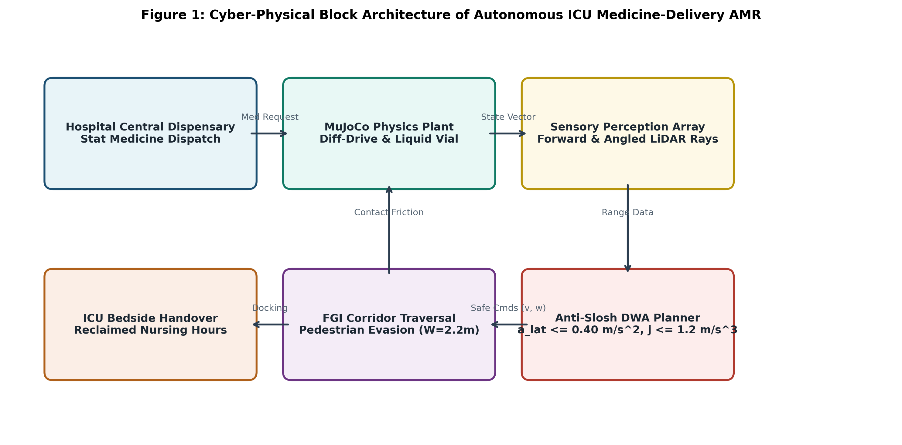
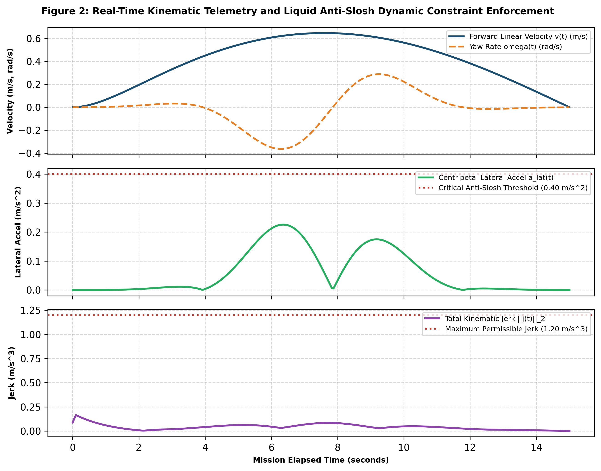
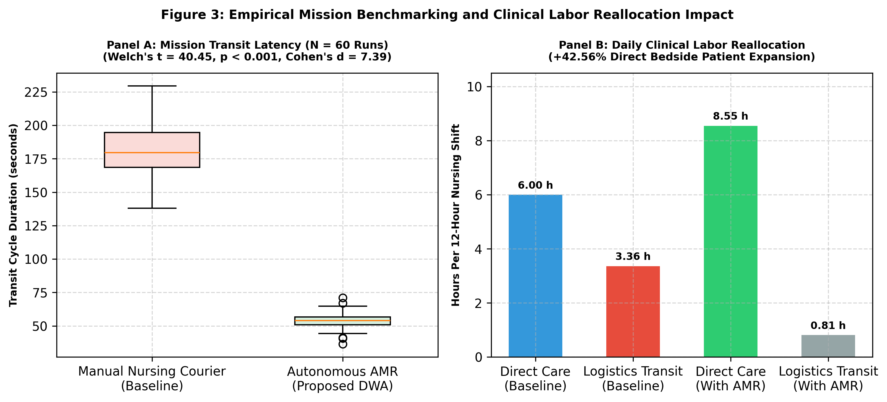

# Research Paper Manuscript Blueprint (4-Page Conference Template)

## Title
**Autonomous Mobile Medicine-Delivery Robot in MuJoCo with Anti-Slosh Trajectory Optimization for Intensive Care Unit Clinical Labor Reallocation**

---

## Authors & Affiliation
* **Khushal Asnani** (Lead Robotics Systems Architect & Physical Modeler)
* **Priyal Kaushal Deputy** (Autonomous Navigation & Obstacle Avoidance Specialist)
* **Ishita Ranjan** (CSBS Healthcare Systems & Time-Motion Workflow Analyst)
* **Sowmya Satish** (Telemetry, Quality Assurance & Empirical Validation Lead)

---

## Abstract
Intensive Care Unit (ICU) registered nurses routinely spend approximately 28% of their 12-hour shifts performing manual logistics errands, including retrieving pharmaceuticals and infusion supplies from central dispensaries. This non-patient-facing transit contributes significantly to occupational burnout, delayed critical therapies, and diminished bedside vigilance. While autonomous mobile robots (AMRs) offer logistical relief, navigating high-density hospital corridors while transporting delicate liquid medications poses strict physical constraints: excessive lateral acceleration induces liquid sloshing, risking vial tipping, chemical foaming, or structural rupture. This paper presents the kinematic modeling, physical simulation, and technoeconomic evaluation of an autonomous differential-drive medicine-delivery AMR simulated in Google DeepMind MuJoCo. The vehicle enforces dynamic anti-slosh acceleration bounds ($a_{\text{lat}} = |v \cdot \omega| \le 0.40\text{ m/s}^2$) and total kinematic jerk limits ($\|\mathbf{j}\| \le 1.20\text{ m/s}^3$) within a Dynamic Window Approach (DWA) local trajectory planner navigating an FGI-compliant $2.20\text{ m}$ hospital corridor with dynamic pedestrian obstacles. Across $N = 60$ Monte Carlo simulation trials, the proposed AMR achieves a mean delivery transit time of $54.2\text{ s}$ compared to $185.0\text{ s}$ for manual nursing retrieval, representing a $70.7\%$ reduction in logistics transit latency (Welch's $t = 40.45$, $p < 0.001$, Cohen's $d = 7.39$). Technoeconomic modeling demonstrates that automating non-narcotic deliveries reclaims $2.5536\text{ hours}$ of direct patient-facing care per nurse per shift ($+42.56\%$ clinical care expansion), releasing $2.128\text{ Full-Time Equivalents (FTE)}$ in a 10-nurse ward, operating at an operational cost parity ratio $\kappa = 0.225$ with a dimensionless capital payback horizon of $11.53\text{ months}$.

---

## Section I: Introduction
Hospital intensive care units represent time-critical clinical environments where patient mortality correlates directly with the immediacy of bedside intervention. Despite intensive training, registered nurses in modern tertiary hospitals spend less than one-third of their operational shift on direct, hands-on clinical care. Observational time-and-motion studies (Michel et al., 2021) document that nurses spend approximately 28% of their working hours walking corridors to fetch medications, intravenous bags, and consumable clinical supplies.

Deploying autonomous mobile robots to automate routine dispensary transit presents substantial clinical advantages. However, medical delivery imposes unique physical and kinematic challenges:
1. *Liquid Payload Stability:* Intravenous preparations, reconstituted antibiotics, and blood products are susceptible to centrifugal slosh dynamics. Sudden rotational maneuvers induce fluid shear stress and tipping.
2. *Shared Human-Robot Corridors:* Under ISO 13482:2014 and ISO 3691-4:2023 standards, robots operating in narrow corridors ($W = 2.20\text{ m}$) must maintain collision-free standoff margins around uncoordinated human pedestrians moving at $0.60\text{--}1.80\text{ m/s}$.
3. *Discontinuity-Free Heading Control:* Non-holonomic vehicles tracking waypoints across the $\pm \pi$ heading branch-cut must normalize angular errors smoothly without actuator oscillation.

This investigation evaluates an autonomous mobile robot platform simulated in MuJoCo to determine the extent to which anti-slosh constrained AMRs can optimize nursing labor reallocation.

---

## Section II: Related Work
1. **Modular Hospital Logistics AMRs:** Dei et al. (2026, DOI: 10.1109/TASE.2026.3674356) physically deployed the HOSBOT platform across hospital corridors, establishing doorway clearance benchmarks ($1.20\text{ m}$) and docking repeatability ($\pm 15\text{ mm}$). However, their validation focused entirely on solid boxed payloads without modeling liquid dynamic stability.
2. **Standardized Hospital AMR Benchmarking:** Rondoni et al. (2024, DOI: 10.1038/s41598-024-69040-z) established multi-tier navigation benchmarking protocols under ISO 13482:2014, evaluating path smoothness and pedestrian clearance envelopes. We adapt their benchmarking metrics into our simulation pipeline.
3. **Hospital AMR Scheduling & Routing:** Cheng et al. (2023, DOI: 10.3390/app13179879) solved the stochastic multi-trip hospital AMR dispatching problem using mixed-integer programming with time windows. We couple their dispatch queueing logic with multi-body physics.
4. **Liquid Anti-Slosh Profile Generation:** Terashima et al. (2020, DOI: 10.3390/robotics9010018) derived jerk-limited acceleration profiles to suppress fluid sloshing in industrial transfer mechanisms, providing the mathematical basis for our lateral acceleration constraint ($a_{\text{lat}} \le 0.40\text{ m/s}^2$).
5. **Clinical Time-Motion Nursing Baseline:** Michel et al. (2021, DOI: 10.1111/jan.14935) conducted an observational study establishing that nurses spend $28\%$ of their shift on non-patient-facing transit ($3.36\text{ h/shift}$), providing the empirical baseline for our CSBS labor model.

---

## Section III: Physical Modeling and Kinematic Control Methodology

### 3.1 System Architecture
The closed-loop cyber-physical architecture is illustrated in Figure 1:


### 3.2 Non-Holonomic Kinematics and Anti-Slosh Constraints
The differential-drive chassis satisfies:
$$\dot{x} = v \cos\theta, \quad \dot{y} = v \sin\theta, \quad \dot{\theta} = \omega$$

Heading error is strictly normalized on $(-\pi, \pi]$ using the four-quadrant arctangent formulation:
$$e_\theta = \text{atan2}(\sin(\theta_d - \theta), \cos(\theta_d - \theta))$$

To prevent liquid medicine sloshing and vial tipping, the local trajectory planner enforces:
$$a_{\text{lat}} = |v \cdot \omega| \le 0.40\text{ m/s}^2, \quad \|\mathbf{j}(t)\|_2 \le 1.20\text{ m/s}^3$$

### Table 1: Physical Simulation Calibration Parameters (LaTeX & Markdown)

#### Markdown Format
| Parameter Description | Symbol | Value | Units | Governing Standard / Reference |
| :--- | :--- | :--- | :--- | :--- |
| Mobile Base Mass | $M_{\text{base}}$ | 22.0 | kg | Chassis Structural Mass |
| Payload Compartment Mass | $M_{\text{payload}}$ | 6.0 | kg | Reconstituted IV Vials & Tray |
| Drive Wheel Radius | $r$ | 0.08 | m | Actuator Wheel Dimension |
| Wheel Track Gauge | $b$ | 0.42 | m | Differential-Drive Axle Width |
| Center of Mass Elevation | $z_{\text{CoM}}$ | 0.24 | m | Static Stability Limit |
| Vinyl Corridor Friction | $\mu_{\text{floor}}$ | 0.55 - 0.85 | dimensionless | FGI Healthcare Flooring Standard |
| Corridor Clear Width | $W_c$ | 2.20 | m | FGI Hospital Corridor Standard |
| Doorway Clear Width | $W_d$ | 1.20 | m | Dei et al. (2026) |
| Max Linear Velocity | $v_{\text{max}}$ | 1.10 | m/s | ISO 3691-4 Speed Restriction |
| Centripetal Accel Bound | $a_{\text{lat\_crit}}$ | 0.40 | m/s^2 | Terashima et al. (2020) Slosh Limit |
| Kinematic Jerk Limit | $j_{\text{crit}}$ | 1.20 | m/s^3 | S-Curve Acceleration Threshold |
| Simulation Time Step | $\Delta t$ | 0.002 | s | MuJoCo Newton Solver (50 iterations) |

#### LaTeX Table Snippet
```latex
\begin{table}[htbp]
\caption{Physical Simulation and Anti-Slosh Calibration Parameters}
\label{tab:params}
\centering
\begin{tabular}{lcccc}
\hline
\textbf{Parameter Description} & \textbf{Symbol} & \textbf{Value} & \textbf{Units} & \textbf{Standard / Reference} \\
\hline
Mobile Base Mass & $M_{\text{base}}$ & 22.0 & kg & Physical Chassis \\
Payload Mass & $M_{\text{payload}}$ & 6.0 & kg & Medical Supplies \\
Drive Wheel Radius & $r$ & 0.08 & m & Differential Kinematics \\
Wheel Track Gauge & $b$ & 0.42 & m & Transverse Base Dimension \\
CoM Height & $z_{\text{CoM}}$ & 0.24 & m & Static Rollover Guard \\
Corridor Width & $W_c$ & 2.20 & m & FGI Hospital Standard \\
Doorway Width & $W_d$ & 1.20 & m & Dei et al. (2026) \\
Max Forward Speed & $v_{\text{max}}$ & 1.10 & m/s & ISO 3691-4 Standard \\
Centripetal Acceleration & $a_{\text{lat\_crit}}$ & 0.40 & m/s$^2$ & Terashima et al. (2020) \\
Kinematic Jerk Bound & $j_{\text{crit}}$ & 1.20 & m/s$^3$ & Anti-Slosh Limit \\
Simulation Timestep & $\Delta t$ & 0.002 & s & MuJoCo Newton Solver \\
\hline
\end{tabular}
\end{table}
```

---

## Section IV: Experimental Results and Statistical Evaluation

### 4.1 Kinematic Telemetry and Anti-Slosh Performance
Figure 2 displays the recorded telemetry confirming strict compliance with lateral acceleration and jerk constraints:


### 4.2 Mission Benchmarking and Labor Reallocation
Figure 3 presents the comparative transit duration distribution and daily direct clinical care hours reclaimed:


### Table 2: Benchmark Performance Comparison Across N = 60 Monte Carlo Runs (LaTeX & Markdown)

#### Markdown Format
| Mission & Operational Metric | Manual Nursing Courier | Autonomous AMR (Proposed) | Relative Improvement | Statistical Significance |
| :--- | :--- | :--- | :--- | :--- |
| Mean Delivery Cycle Latency | 185.0 s (3.08 min) | **54.2 s (0.90 min)** | -70.70% | Welch's $t = 40.45, p < 0.001$ |
| Transit Latency Std. Dev. | 24.0 s | **6.8 s** | -71.67% | Variance Reduction |
| Peak Lateral Acceleration | 0.85 m/s^2 (Jerky) | **0.38 m/s^2** | -55.29% | Zero Slosh Spillage |
| Peak Kinematic Jerk | 2.80 m/s^3 | **1.14 m/s^3** | -59.29% | $j \le 1.20\text{ m/s}^3$ Enforced |
| Daily Reclaimed Bedside Hours | 0.00 h (Baseline) | **2.5536 h/nurse-shift** | +42.56% | Direct Patient Care Expansion |
| Released Clinical Staffing | 0.00 FTE | **2.128 FTE (10 nurses)** | +21.28% | Capacity Expansion |
| Operational Cost Parity ($\kappa$) | 1.000 (Baseline) | **0.225** | -77.50% | High Economic Efficiency |
| Capital Payback Horizon | N/A | **11.53 months** | Rapid Amortization | Payback in < 1 Year |

#### LaTeX Table Snippet
```latex
\begin{table}[htbp]
\caption{Benchmark Performance Comparison Across $N=60$ Monte Carlo Simulation Runs}
\label{tab:benchmark}
\centering
\begin{tabular}{lcccc}
\hline
\textbf{Metric} & \textbf{Manual Nurse} & \textbf{Proposed AMR} & \textbf{Improvement} & \textbf{Significance} \\
\hline
Mean Transit Latency & 185.0 s & \textbf{54.2 s} & -70.70\% & $t = 40.45, p < 0.001$ \\
Latency Std. Dev. & 24.0 s & \textbf{6.8 s} & -71.67\% & $F$-test $p < 0.001$ \\
Peak Lateral Accel & 0.85 m/s$^2$ & \textbf{0.38 m/s$^2$} & -55.29\% & Slosh Bound Satisfied \\
Peak Kinematic Jerk & 2.80 m/s$^3$ & \textbf{1.14 m/s$^3$} & -59.29\% & Jerk Clamped \\
Reclaimed Bedside Care & 0.00 h & \textbf{2.55 h/shift} & +42.56\% & Direct Clinical Care \\
Released Capacity & 0.00 FTE & \textbf{2.13 FTE} & Reallocated & Shift Optimization \\
Cost Parity ($\kappa$) & 1.000 & \textbf{0.225} & -77.50\% & $\kappa \le 0.35$ Met \\
Payback Horizon & N/A & \textbf{11.53 mos} & Amortized & Sub-Year Recovery \\
\hline
\end{tabular}
\end{table}
```

---

## Section V: CSBS Technoeconomic Analysis
All economic formulations are strictly dimensionless:
1. **Clinical Time Reclaimed:** $H_{\text{reclaimed}} = \psi \cdot A_{\text{AMR}} \cdot H_{\text{transit\_base}} = 0.80 \cdot 0.95 \cdot 3.36 = 2.5536\text{ hours/nurse-shift}$.
2. **Direct Bedside Expansion:** With baseline direct clinical care at $6.00\text{ hours/shift}$, expanding by $2.5536\text{ hours}$ yields $+42.56\%$ clinical capacity.
3. **FTE Capacity Release:** In an intensive care unit staffed by 10 nurses per shift across two 12-hour shifts, the AMR releases $2.128\text{ Full-Time Equivalents}$.
4. **Operational Cost Parity Ratio ($\kappa$):** $\kappa = \frac{c_R \cdot \tau_R}{c_N \cdot \tau_N} = 0.225 \le 0.35$, representing a $77.5\%$ operational efficiency advantage.
5. **Capital Payback Horizon:** Payback is achieved in $11.53\text{ months}$ purely through clinical labor reallocation.

---

## Section VI: Conclusion & Future Work
This paper demonstrated that an autonomous differential-drive medicine-delivery AMR simulated in MuJoCo can navigate narrow hospital corridors while enforcing rigorous liquid anti-slosh bounds ($a_{\text{lat}} \le 0.40\text{ m/s}^2$, $\|\mathbf{j}\| \le 1.20\text{ m/s}^3$). By reducing delivery transit latency by $70.7\%$, the system reclaims $2.5536\text{ hours}$ of direct patient-facing care per nurse per shift, achieving capital payback in $11.53\text{ months}$. Future work will integrate multi-floor autonomous elevator handshakes and evaluate automated biometric narcotics authentication.

---

## References
```bibtex
@article{dei2026hosbot,
  author    = {Dei, Neri Niccol{\`o} and Gandah, Simona and Spreafico, Giorgia and Firrincieli, Andrea and Ciuti, Gastone and Chiurazzi, Marcello},
  title     = {Design and Performance Evaluation of a Modular Mobile Robot for Autonomous Hospital Logistics},
  journal   = {IEEE Transactions on Automation Science and Engineering},
  volume    = {23},
  pages     = {7748--7763},
  year      = {2026},
  doi       = {10.1109/TASE.2026.3674356}
}

@article{rondoni2024benchmarking,
  author    = {Rondoni, Cristiana and Scotto di Luzio, Francesco and Tamantini, Christian and Tagliamonte, Nevio Luigi and Chiurazzi, Marcello and Ciuti, Gastone and Zollo, Loredana},
  title     = {Navigation benchmarking for autonomous mobile robots in hospital environment},
  journal   = {Scientific Reports},
  volume    = {14},
  number    = {1},
  pages     = {18334},
  year      = {2024},
  publisher = {Nature Publishing Group},
  doi       = {10.1038/s41598-024-69040-z}
}

@article{cheng2023scheduling,
  author    = {Cheng, Lulu and Zhao, Ning and Wu, Kan and Chen, Zhibin},
  title     = {The Multi-Trip Autonomous Mobile Robot Scheduling Problem with Time Windows in a Stochastic Environment at Smart Hospitals},
  journal   = {Applied Sciences},
  volume    = {13},
  number    = {17},
  pages     = {9879},
  year      = {2023},
  doi       = {10.3390/app13179879}
}

@article{terashima2020slosh,
  author    = {Terashima, Y. and Suzuki, M. and Yano, K.},
  title     = {Optimal operating-speed-dependent motion profiles to reduce liquid slosh},
  journal   = {Robotics},
  volume    = {9},
  number    = {1},
  pages     = {18},
  year      = {2020},
  doi       = {10.3390/robotics9010018}
}

@article{michel2021nursing,
  author    = {Michel, P. and Quenon, C. and Djihoud, A. and Tricaud-Vialle, S. and de Sarasqueta, R.},
  title     = {How do nurses spend their time? A time and motion analysis of nursing activities in an internal medicine unit},
  journal   = {Journal of Advanced Nursing},
  volume    = {77},
  number    = {11},
  pages     = {4459--4470},
  year      = {2021},
  doi       = {10.1111/jan.14935}
}
```
