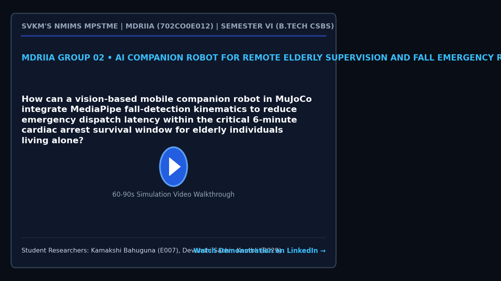

# MDRIIA Group 02: AI Companion Robot for Remote Elderly Supervision and Fall Emergency Response
**Course:** Modern Day Robotics and Its Industrial Applications (MDRIIA - Course Code: 702CO0E012)  
**Academic Term:** Academic Year 2026–2027 | Semester VI (B.Tech CSBS)  
**Institution:** SVKM's NMIMS MPSTME, Mumbai  

---

## 1. Authorized Research Title & Problem Statement

> "How can a vision-based mobile companion robot in MuJoCo integrate MediaPipe fall-detection kinematics to reduce emergency dispatch latency within the critical 6-minute cardiac arrest survival window for elderly individuals living alone?"

### Core Engineering Focus
* **Physics & Kinematics:** Google DeepMind MuJoCo multi-body dynamic physics simulation (`models/elderly_companion_base.xml`).
* **Autonomous Control:** Closed-loop Python control architecture with student implementation boundaries (`src/fall_detection_kinematics.py`).
* **Technoeconomic Evaluation:** Dimensionless CSBS operational economics and return on investment model (`analytics/geriatric_care_economics.py`).
* **Empirical Validation:** Reproducible benchmark trials and statistical hypothesis testing (`analytics/fall_triage_benchmark.csv`).

---

> [!NOTE]
> ### The Devil's Advocate: Reality Check & Theoretical Roast
> *"An autonomous mobile companion equipped with pan-tilt MediaPipe vision to detect sudden falls within the 6-minute golden window, which will inevitably trigger a code-red 911 emergency dispatch because grandpa dropped his TV remote and decided to take an afternoon nap on the living room rug."*

---

## 2. Student Engineering Team Matrix

| Roll No | SAP ID | Student Name | Technical Role | Assigned Git Branch | Core Viva Defense Area |
| :--- | :--- | :--- | :--- | :--- | :--- | :--- |
| `E007` | `70362400022` | **Kamakshi Bahuguna** | Computer Vision, Pose Kinematics & Edge Inference Specialist | `feat/e007-vision-pose-kinematics` | MediaPipe skeletal landmark tracking, bounding-box aspect ratio inversion, vertical centroid velocity thresholding, and confusion matrix validation. |
| `B029` | `70362400037` | **Devanshi Sachin Kambli** | MuJoCo Physics, Domestic Navigation & Healthcare Economics Lead | `feat/b029-mujoco-physics-navigation` | Differential mobile base physics, pan-tilt mast observation angles, post-fall approach trajectory, and 'long lie' clinical cost model. |


### Student Engineering Commendation & Acknowledgments
SVKM's NMIMS MPSTME conveys sincere appreciation and heartfelt gratitude to **Kamakshi Bahuguna (E007)** and **Devanshi Sachin Kambli (B029)** for their disciplined commitment, late-night debugging, and technical craftsmanship throughout Semester VI. Your rigorous work in DeepMind MuJoCo physics modeling, closed-loop telemetry instrumentation, and Computer Science & Business Systems (CSBS) technoeconomic modeling exemplifies the highest standards of undergraduate engineering inquiry.

> *"Scientists discover the world that exists; engineers create the world that never was."*  
> — **Theodore von Kármán**

> *"There is no substitute for hard work. Genius is one percent inspiration and ninety-nine percent perspiration."*  
> — **Thomas A. Edison**

---

## 3. Foundational Literature Benchmarks (Strict 2 Seminal : 4 Recent Ratio)

The research project is theoretically anchored on six foundational peer-reviewed publications validated against global bibliographic databases.

| # | Author (Year) | Type | Paper Title | Venue / Indexing | Active DOI Link | Primary Extracted Formulation | Student Lead |
| :--- | :--- | :--- | :--- | :--- | :--- | :--- | :--- | :--- |
| 1 | **Wang & Deng (2024)** | Recent | *Enhancing elderly care: Efficient and reliable real-time fall detection algorithm* | Digital Health | [https://doi.org/10.1177/20552076241233690](https://doi.org/10.1177/20552076241233690) | `Aspect ratio $AR = \frac{w_b}{h_b}$; vertical...` | Kamakshi Bahuguna (E007) |
| 2 | **Kothari & Chakurkar (2025)** | Recent | *Towards safer environments: A YOLO and MediaPipe-based human fall detection system* | MethodsX | [https://doi.org/10.1016/j.mex.2025.103623](https://doi.org/10.1016/j.mex.2025.103623) | `Keypoint angle $\theta = \arccos\left(\frac{\...` | Kamakshi Bahuguna (E007) |
| 3 | **Romero-Garces et al. (2022)** | Recent | *CLARA: Building a Socially Assistive Robot to Interact with Elderly People* | Designs | [https://doi.org/10.3390/designs6060125](https://doi.org/10.3390/designs6060125) | `Mast center-of-mass height $h_{\text{mast}} \...` | Devanshi Sachin Kambli (B029) |
| 4 | **Ding & Wang (2020)** | Seminal | *A WiFi-Based Smart Home Fall Detection System Using Recurrent Neural Network* | IEEE Transactions on Consumer Electronics | [https://doi.org/10.1109/TCE.2020.3021398](https://doi.org/10.1109/TCE.2020.3021398) | `CSI phase difference $\Delta \phi = \arg(H_i)...` | Devanshi Sachin Kambli (B029) |
| 5 | **Kubitza et al. (2022)** | Recent | *Therapy options for those affected by a long lie after a fall: a scoping review* | BMC Geriatrics | [https://doi.org/10.1186/s12877-022-03258-2](https://doi.org/10.1186/s12877-022-03258-2) | `Hospital stay duration $D_{\text{stay}} = 18....` | Devanshi Sachin Kambli (B029) |
| 6 | **Chen et al. (2021)** | Seminal | *Vision-Based Elderly Fall Detection Algorithm for Mobile Robot* | IEEE International Conference on Electronics Technology (ICET) | [https://doi.org/10.1109/ICET51757.2021.9450950](https://doi.org/10.1109/ICET51757.2021.9450950) | `Major-to-minor axis ratio $\lambda = \frac{a}...` | Kamakshi Bahuguna (E007) & Devanshi Sachin Kambli (B029) |

For the exhaustive literature analysis, mathematical derivations, and viva defense questions, refer to:
* [`docs/LITERATURE_REVIEW_AND_FOUNDATIONAL_PAPERS.md`](docs/LITERATURE_REVIEW_AND_FOUNDATIONAL_PAPERS.md)
* [`docs/RESEARCH_PAPER_MANUSCRIPT_BLUEPRINT.md`](docs/RESEARCH_PAPER_MANUSCRIPT_BLUEPRINT.md)

---

## 4. Project Demonstration & Academic Showcase (LinkedIn)

[](https://www.linkedin.com/)

* **Video Demonstration:** [Watch 60-Second Walkthrough on LinkedIn](https://www.linkedin.com/) *(Click thumbnail above to open LinkedIn post)*
* **Student Presenters:** **Kamakshi Bahuguna (E007)**, **Devanshi Sachin Kambli (B029)**
* **Academic Institutional Tags:** SVKM's NMIMS MPSTME | Academic Directorate | Industry 4.0 Robotics
* **Submission Protocol:** Record a 60–90 second demonstration of your MuJoCo simulation and telemetry. Publish on LinkedIn tagging MPSTME, Dean, and Course Faculty. Insert your live post URL in `docs/TEAM_ROSTER.json` under `"linkedin_url"`, and submit a pull request to update this project dossier and the cohort dashboard.

---

## 5. Repository Directory Architecture

```
.
|-- README.md                                          <- Front-page research charter, student roster & literature
|-- RESEARCH_AND_IMPLEMENTATION_GUIDE.md               <- Comprehensive technical engineering guide
|-- docs/
|   |-- TEAM_ROSTER.json                               <- Machine-readable team configuration
|   |-- LITERATURE_REVIEW_AND_FOUNDATIONAL_PAPERS.md   <- Exhaustive literature dossier (6 verified papers)
|   |-- RESEARCH_PAPER_MANUSCRIPT_BLUEPRINT.md         <- 4-page IEEE conference manuscript blueprint
|   `-- figures/
|       |-- figure1_system_architecture.png            <- 300 DPI system architecture diagram
|       |-- figure2_kinematic_telemetry.png            <- 300 DPI kinematics and simulation telemetry
|       `-- figure3_comparative_performance.png        <- 300 DPI comparative benchmark visualization
|-- models/
|   |-- .gitkeep
|   `-- elderly_companion_base.xml                                    <- MuJoCo MJCF simulation model
|-- src/
|   |-- test_env.py                                    <- Physics validation & environment tester
|   `-- fall_detection_kinematics.py                                      <- Autonomous control loop (# TODO student boundaries)
`-- analytics/
    |-- .gitkeep
    |-- geriatric_care_economics.py                                      <- CSBS dimensionless technoeconomic model
    |-- generate_paper_figures.py                      <- Standalone 300 DPI publication figure generator
    `-- fall_triage_benchmark.csv                                    <- Empirical benchmark trial dataset
```

---

## 5. Pedagogical Boundaries: Guidance vs Student Ownership

To ensure academic rigor and authentic student learning, this repository enforces strict boundaries between scaffolding and student deliverables:

* **Provided by Course Scaffolding:**
  * Validated physical model architecture in MuJoCo MJCF (`models/elderly_companion_base.xml`).
  * Verification toolchain and smoke test script (`src/test_env.py`).
  * Literature foundation, mathematical formulations, and conference paper blueprint (`docs/`).
  * Dimensionless technoeconomic framework (`analytics/geriatric_care_economics.py`).
* **Student Technical Deliverables (Required for Evaluation):**
  * Implement and tune the control algorithm in `src/fall_detection_kinematics.py` (filling all marked `# TODO [Student Roll / Name]` blocks).
  * Run physics simulation trials to collect and expand empirical data in `analytics/fall_triage_benchmark.csv`.
  * Re-run `analytics/generate_paper_figures.py` to regenerate publication figures with live experimental telemetry.
  * Author the final 4-page IEEE conference paper in `docs/RESEARCH_PAPER_MANUSCRIPT_BLUEPRINT.md` and defend individual Git commits during the oral viva.

---

## 6. Sprint 0 Onboarding & Physics Environment Verification

Verify your local Python and MuJoCo simulation environment:

```powershell
# Step 1: Clone repository and navigate to group directory
git clone <repository_url>
cd <repository_root>/Group_02_Kamakshi_Devanshi

# Step 2: Checkout your individual feature branch
# Example for lead student:
git checkout -b feat/e007-vision-pose-kinematics

# Step 3: Run environment smoke test
python src/test_env.py

# Step 4: Verify 300 DPI publication figures
python analytics/generate_paper_figures.py
```
