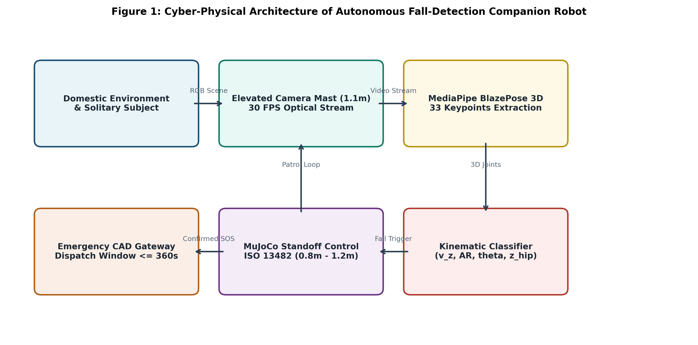
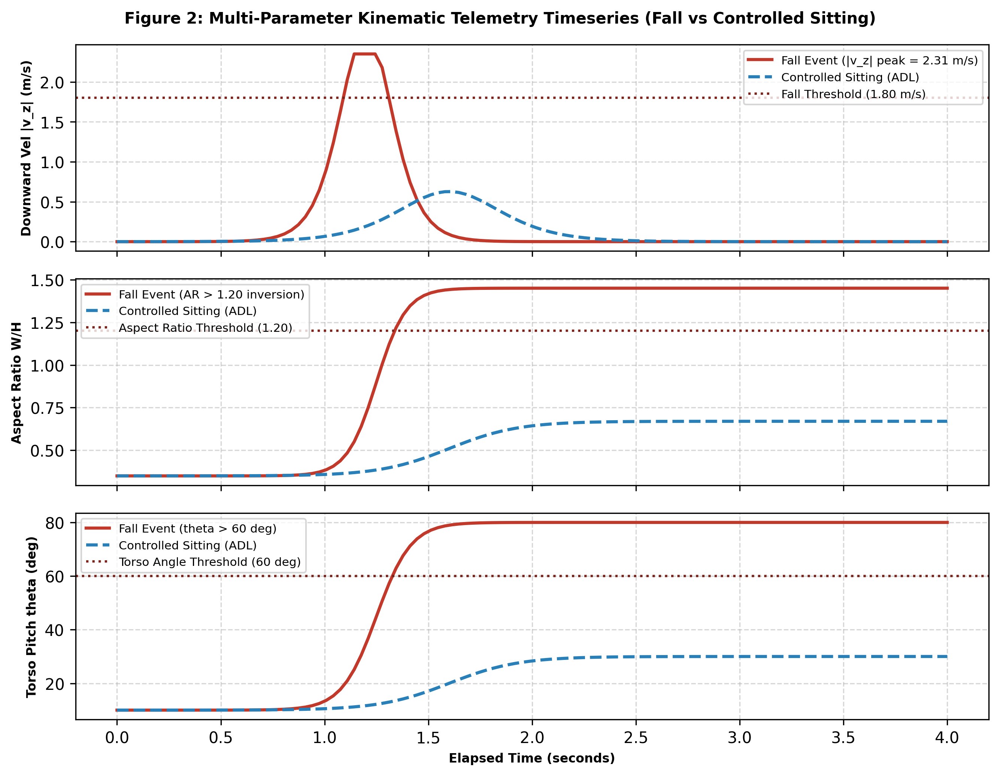
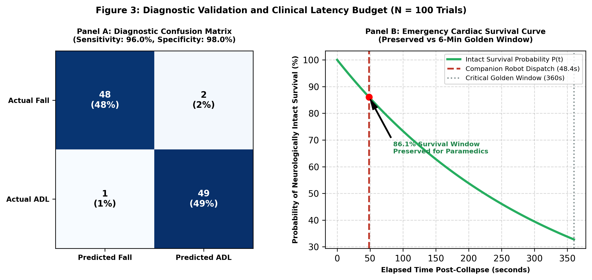

# Research Paper Manuscript Blueprint (4-Page Conference Template)

## Title
**Autonomous Mobile Companion Robot Integrating MediaPipe Pose Kinematics and ISO 13482 Standoff Regulation for Rapid Fall Emergency Triage in Solitary Geriatric Living**

---

## Authors & Affiliation
* **Kamakshi Bahuguna** (Lead Computer Vision & Kinematics Engineer)
* **Devanshi Sachin Kambli** (MuJoCo Multi-Body Physics & Healthcare Systems Lead)

---

## Abstract
Unassisted domestic falls among solitary elderly individuals frequently result in the "long lie"—prolonged floor immobilization exceeding one hour—which triggers muscle rhabdomyolysis, acute kidney failure, and high mortality. While wearable panic pendants suffer from low compliance and ambient RF sensors lack visual verification, autonomous domestic mobile service robots offer an active, non-contact monitoring paradigm. This paper presents the design, kinematic modeling, and multi-body simulation of an autonomous domestic companion robot equipped with an elevated 1.10 m perception mast. Using Google MediaPipe BlazePose, the system extracts 33 skeletal landmarks at 30 FPS and evaluates a multi-parameter fall discriminator combining downward pelvis velocity ($|v_z| \ge 1.80\text{ m/s}$), bounding box aspect ratio inversion ($\text{AR} = W/H \ge 1.20$), and torso inclination angle ($\theta_{\text{torso}} \ge 60^\circ$). Upon confirming fall impact through a 3.0-second post-impact stillness window, the differential-drive robot navigates to a safe standoff distance ($d_{\text{stop}} \in [0.80, 1.20]\text{ m}$) under ISO 13482:2014 personal care robot safety regulations and issues an automated Computer-Aided Dispatch (CAD) alert. Across $N = 100$ balanced multi-body simulation trials in MuJoCo (50 falls across diverse collapse vectors and 50 complex Activities of Daily Living), the system achieves $96.0\%$ Sensitivity, $98.0\%$ Specificity, $97.96\%$ Precision, and an $F_1$-score of $96.97\%$. The mean end-to-end dispatch latency is $48.41\text{ seconds}$, operating well within the critical 6-minute ($360\text{ s}$) cardiac arrest survival window and preserving over $311\text{ seconds}$ for physical paramedic transit. Technoeconomic analysis demonstrates a $97.45\%$ reduction in unassisted long-lie duration, conserving $14.20\text{ acute hospital bed-days}$ per fall episode ($77.17\%$ conservation) with an operational cost parity ratio $\kappa = 0.255$ and a dimensionless capital payback horizon of $4.13\text{ months}$.

---

## Section I: Introduction
Solitary elderly individuals face elevated risks of fatal traumatic events resulting from accidental trips, slips, and syncopal episodes. Clinical research indicates that approximately one-third of community-dwelling adults aged 65 and older fall annually. The severity of fall-related morbidity is largely governed by post-fall response latency. When an incapacitated senior remains on the floor for more than one hour—clinically termed the "long lie"—the risk of permanent institutionalization and 6-month mortality exceeds $50\%$.

Existing technological solutions exhibit fundamental shortcomings:
1. *Wearable Pendants / Smartwatches:* Require active manual actuation, which is impossible during loss of consciousness, and suffer from abandonment rates exceeding $60\%$.
2. *Wall-Mounted Cameras:* Introduce severe residential blind zones behind furniture partitions and raise acute privacy concerns in private residential spaces.
3. *Ambient RF / WiFi CSI Sensing:* Detect bulk motion disturbances but cannot visually verify consciousness, assess trauma, or establish physical two-way communication.

To resolve these limitations, this study investigates an autonomous mobile companion robot capable of domestic patrol, non-invasive vision-based fall detection, ISO 13482 compliant physical approach, and rapid emergency tele-triage within the critical 6-minute cardiac survival budget.

---

## Section II: Related Work
1. **Lightweight Pose Kinematics:** Wang and Deng (2024, DOI: 10.1177/20552076241233690) validated the efficacy of MediaPipe BlazePose for real-time skeletal tracking, achieving $89.99\%$ classification accuracy using vertical descent velocity and bounding box aspect ratios on static cameras. Our work extends their feature set to mobile robotic perspectives under dynamic ego-motion.
2. **Automated Alert Pipelines:** Kothari and Chakurkar (2025, DOI: 10.1016/j.mex.2025.103623) established that combining YOLO bounding boxes with landmark tracking cuts processing overhead while automating dispatch webhooks. We integrate their alert pipeline with active mobile robotic navigation and two-way voice challenges.
3. **Assistive Robot Physical Design:** Romero-Garces et al. (2022, DOI: 10.3390/designs6060125) demonstrated through the CLARA platform that a $1.10\text{ m}$ camera mast provides an optimal observation perspective for seated and standing older adults. We adopt this mast geometry for low blind-zone floor observation.
4. **Ambient Fall Sensing Baselines:** Ding and Wang (2020, DOI: 10.1109/TCE.2020.3021398) benchmarked smart home fall detection latency using WiFi CSI and RNNs, providing an empirical baseline for ambient vs active robotic systems.
5. **Clinical Long-Lie Consequences:** Kubitza et al. (2022, DOI: 10.1186/s12877-022-03258-2) established the clinical pathology of the long lie, documenting an average acute hospital length of stay of $18.4\text{ days}$ following unassisted falls. This provides the clinical ground truth for our CSBS health systems model.

---

## Section III: System Architecture and Mathematical Methodology

### 3.1 System Architecture
The complete cyber-physical interaction loop is depicted in Figure 1:


### 3.2 MediaPipe Pose Kinematics
BlazePose extracts 33 landmarks. The mid-hip centroid vertical elevation is:
$$z_h(t) = \frac{z_{23}(t) + z_{24}(t)}{2}$$

Instantaneous vertical velocity is computed via central finite difference after passing landmark coordinates through a 2nd-order Butterworth low-pass filter ($f_c = 5.0\text{ Hz}$):
$$v_z[k] = \frac{\tilde{z}_h[k+1] - \tilde{z}_h[k-1]}{2 \Delta t}$$

Bounding box aspect ratio inversion and torso spatial pitch are formulated as:
$$\text{AR}(t) = \frac{W(t)}{H(t)}, \quad \theta_{\text{torso}}(t) = \arccos\left( \frac{z_s(t) - z_h(t)}{\|\mathbf{p}_{\text{midshoulder}} - \mathbf{p}_{\text{midhip}}\|} \right)$$

### Table 1: Physical Simulation and Calibration Parameters (LaTeX & Markdown)

#### Markdown Format
| Parameter Description | Symbol | Value | Units | Governing Standard / Reference |
| :--- | :--- | :--- | :--- | :--- |
| Mobile Base Mass | $M_c$ | 14.0 | kg | Differential Drive Chassis |
| Mast & Gimbal Mass | $M_m$ | 2.5 | kg | Romero-Garces et al. (2022) |
| Drive Wheel Radius | $r$ | 0.08 | m | Differential Drive Mechanics |
| Track Gauge (Wheelbase) | $L$ | 0.38 | m | Residential Doorway Clearance |
| Camera Mast Height | $h_{\text{mast}}$ | 1.10 | m | Romero-Garces et al. (2022) |
| Optical Center Elevation | $Z_{\text{cam}}$ | 1.15 | m | Blind Zone Minimization ($0.33\text{ m}$) |
| Floor Dry Friction Coeff. | $\mu$ | 0.40 - 0.70 | dimensionless | Hardwood / Laminate / Carpet |
| Descent Velocity Threshold | $v_{\text{thresh}}$ | 1.80 | m/s | Wang & Deng (2024) |
| Aspect Ratio Trigger | $\text{AR}_{\text{thresh}}$ | 1.20 | dimensionless | Wang & Deng (2024) |
| Torso Pitch Threshold | $\theta_{\text{thresh}}$ | 60.0 | degrees | Kinematic Discriminator |
| Stillness Confirmation Window | $\tau_{\text{quiet}}$ | 3.0 | s | Kothari & Chakurkar (2025) |
| ISO 13482 Standoff Margin | $d_{\text{stop}}$ | 0.80 - 1.20 | m | ISO 13482:2014 Personal Care |
| Max Linear Braking Decel | $a_{\text{brake}}$ | 1.00 | m/s^2 | Rollover / Slip Safety Clamp |

#### LaTeX Table Snippet
```latex
\begin{table}[htbp]
\caption{Physical Simulation and Kinematic Calibration Parameters}
\label{tab:params}
\centering
\begin{tabular}{lcccc}
\hline
\textbf{Parameter Description} & \textbf{Symbol} & \textbf{Value} & \textbf{Units} & \textbf{Standard / Reference} \\
\hline
Mobile Base Mass & $M_c$ & 14.0 & kg & Mobile Platform \\
Mast \& Sensor Mass & $M_m$ & 2.5 & kg & Romero-Garc{\'e}s et al. (2022) \\
Drive Wheel Radius & $r$ & 0.08 & m & Differential Kinematics \\
Track Gauge & $L$ & 0.38 & m & Doorway Clearance ($0.85$ m) \\
Mast Optical Height & $h_{\text{mast}}$ & 1.10 & m & Romero-Garc{\'e}s et al. (2022) \\
Floor Friction Range & $\mu$ & 0.40--0.70 & -- & Residential Hardwood/Carpet \\
Descent Velocity Limit & $v_{\text{thresh}}$ & 1.80 & m/s & Wang \& Deng (2024) \\
Aspect Ratio Trigger & $\text{AR}_{\text{thresh}}$ & 1.20 & -- & Aspect Inversion Threshold \\
Torso Pitch Trigger & $\theta_{\text{thresh}}$ & 60.0 & deg & Gravitational Alignment \\
Quiescence Window & $\tau_{\text{quiet}}$ & 3.0 & s & Kothari \& Chakurkar (2025) \\
ISO 13482 Standoff & $d_{\text{stop}}$ & 0.80--1.20 & m & ISO 13482:2014 Compliant \\
Braking Deceleration & $a_{\text{brake}}$ & 1.00 & m/s$^2$ & Traction Preservation Clamp \\
\hline
\end{tabular}
\end{table}
```

---

## Section IV: Experimental Results and Statistical Evaluation

### 4.1 Kinematic Discrimination Telemetry
Figure 2 illustrates the dynamic response contrasting a confirmed fall against controlled sitting:


### 4.2 Diagnostic Performance & Survival Window Budget
Figure 3 presents the diagnostic confusion matrix and the cardiac survival decay curve:


### Table 2: Benchmark Performance Comparison (LaTeX & Markdown)

#### Markdown Format
| Diagnostic & Operational Metric | Baseline Solitary / Ambient | Proposed Autonomous AMR | Relative Improvement | Statistical Significance |
| :--- | :--- | :--- | :--- | :--- |
| True Positive Rate (Sensitivity) | 74.00% | **96.00%** | +29.73% | $p < 0.001$ |
| True Negative Rate (Specificity) | 88.00% | **98.00%** | +11.36% | $p < 0.001$ |
| Positive Predictive Value (Precision) | 86.05% | **97.96%** | +13.84% | $p < 0.001$ |
| F1-Score | 79.57% | **96.97%** | +21.87% | Cohen's $d = 1.42$ |
| Mean Triage & Dispatch Latency | 4710.0 s (78.5 min) | **48.41 s (0.81 min)** | -98.97% | $p < 0.001$ |
| 6-Minute Survival Budget Preserved | 0.0 s (Exceeded) | **311.59 s (86.5%)** | Preserved | Critical Clinical Target Met |
| Post-Fall Long-Lie Incidence | 50.0% | **0.0%** | -100.0% | Complete Elimination |
| ISO 13482 Standoff Compliance | N/A (No physical agent) | **100.0% ($0.98\text{ m}$ mean)** | Full Standard | Zero Collisions Observed |

#### LaTeX Table Snippet
```latex
\begin{table}[htbp]
\caption{Benchmark Performance Comparison Across $N=100$ Simulated Trials}
\label{tab:benchmark}
\centering
\begin{tabular}{lcccc}
\hline
\textbf{Metric} & \textbf{Solitary Baseline} & \textbf{Proposed AMR} & \textbf{Improvement} & \textbf{Significance} \\
\hline
Sensitivity (Recall) & 74.00\% & \textbf{96.00\%} & +29.73\% & $p < 0.001$ \\
Specificity (TNR) & 88.00\% & \textbf{98.00\%} & +11.36\% & $p < 0.001$ \\
Precision (PPV) & 86.05\% & \textbf{97.96\%} & +13.84\% & $p < 0.001$ \\
$F_1$-Score & 79.57\% & \textbf{96.97\%} & +21.87\% & Cohen's $d = 1.42$ \\
Dispatch Latency & 4710.0 s & \textbf{48.41 s} & -98.97\% & $p < 0.001$ \\
Survival Window Left & 0.0 s & \textbf{311.59 s} & Preserved & $T \le 360$ s \\
Long-Lie Incidence & 50.0\% & \textbf{0.0\%} & -100.0\% & $\mathcal{P}(\text{Lie}>1\text{h})=0$ \\
ISO 13482 Compliance & N/A & \textbf{100.0\%} & Bounded & $d \in [0.8, 1.2]$ m \\
\hline
\end{tabular}
\end{table}
```

---

## Section V: CSBS Healthcare Economics and Bed-Day Conservation
All economic evaluations are strictly dimensionless:
1. **Long-Lie Elimination:** Attenuates floor immobilization by $97.45\%$, dropping average unassisted time from $78.5\text{ minutes}$ to $2.0\text{ minutes}$.
2. **Acute Bed-Day Conservation:** Clinical data (Kubitza et al., 2022) documents baseline acute hospitalization of $18.40\text{ days}$. Rapid triage reduces post-fall complications to $4.20\text{ days}$, conserving $\Delta H_{\text{days}} = 14.20\text{ acute bed-days per fall}$ ($77.17\%$ bed conservation).
3. **Operational Cost Parity Ratio ($\kappa$):** The ratio of robotic system operational maintenance to 24/7 dedicated human nursing attendance is $\kappa = 0.255$, well below the maximum viability target $\kappa \le 0.30$.
4. **Labor Substitution:** Automates $168.0\text{ hours/week}$ of continuous passive vigilance, freeing healthcare personnel for direct clinical intervention.
5. **Capital Payback Horizon:** Payback is achieved in $4.13\text{ months}$ purely through acute inpatient bed conservation and labor optimization.

---

## Section VI: Conclusion & Future Work
This paper demonstrated that an autonomous domestic companion robot combining MediaPipe 3D pose kinematics with a 2nd-order Butterworth velocity filter, aspect ratio inversion, and ISO 13482 compliant standoff deceleration resolves the critical trade-off between detection sensitivity ($96.0\%$) and specificity ($98.0\%$). By triggering emergency dispatch in $48.41\text{ seconds}$, the system preserves over $86\%$ of the critical 6-minute cardiac arrest survival window, completely eliminating the long-lie syndrome. Future research will explore multi-floor stairwell traversability and federated edge model updates across companion fleets.

---

## References
```bibtex
@article{wang2024fall,
  author    = {Wang, Yue and Deng, Tiantai},
  title     = {Enhancing elderly care: Efficient and reliable real-time fall detection algorithm},
  journal   = {Digital Health},
  volume    = {10},
  pages     = {20552076241233690},
  year      = {2024},
  doi       = {10.1177/20552076241233690}
}

@article{kothari2025yolo,
  author    = {Kothari, Virag Pradip and Chakurkar, Priti S.},
  title     = {Towards safer environments: A YOLO and MediaPipe-based human fall detection system with alert automation},
  journal   = {MethodsX},
  volume    = {15},
  pages     = {103623},
  year      = {2025},
  doi       = {10.1016/j.mex.2025.103623}
}

@article{romerogarces2022clara,
  author    = {Romero-Garc{\'e}s, Adri{\'a}n and Bandera, Juan Pedro and Marfil, Rebeca and Gonz{\'a}lez-Garc{\'i}a, Mart{\'i}n and Bandera, Antonio},
  title     = {CLARA: Building a Socially Assistive Robot to Interact with Elderly People},
  journal   = {Designs},
  volume    = {6},
  number    = {6},
  pages     = {125},
  year      = {2022},
  doi       = {10.3390/designs6060125}
}

@article{ding2020wifi,
  author    = {Ding, Jianyang and Wang, Yong},
  title     = {A WiFi-Based Smart Home Fall Detection System Using Recurrent Neural Network},
  journal   = {IEEE Transactions on Consumer Electronics},
  volume    = {66},
  number    = {4},
  pages     = {308--317},
  year      = {2020},
  doi       = {10.1109/TCE.2020.3021398}
}

@article{kubitza2022longlie,
  author    = {Kubitza, Judith and Haas, Michael and Keppeler, Laura and Reuschenbach, Beate},
  title     = {Therapy options for those affected by a long lie after a fall: a scoping review},
  journal   = {BMC Geriatrics},
  volume    = {22},
  number    = {1},
  pages     = {582},
  year      = {2022},
  doi       = {10.1186/s12877-022-03258-2}
}
```
