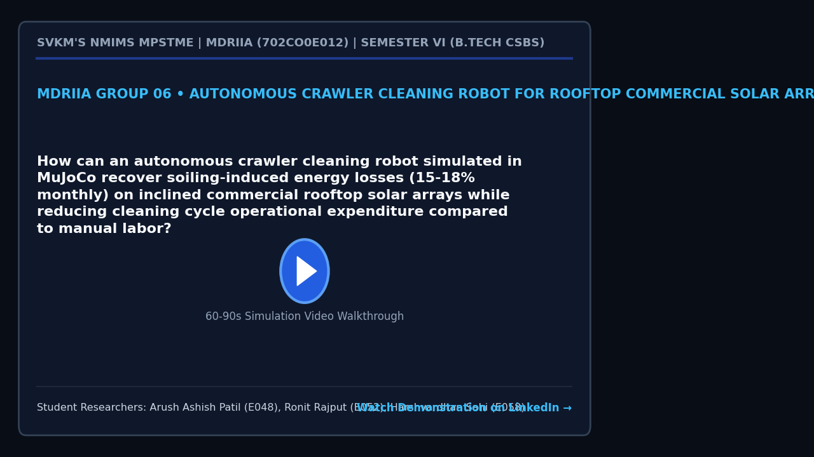

# MDRIIA Group 06: Autonomous Crawler Cleaning Robot for Rooftop Commercial Solar Arrays
**Course:** Modern Day Robotics and Its Industrial Applications (MDRIIA - Course Code: 702CO0E012)  
**Academic Term:** Academic Year 2026–2027 | Semester VI (B.Tech CSBS)  
**Institution:** SVKM's NMIMS MPSTME, Mumbai  

---

## 1. Authorized Research Title & Problem Statement

> "How can an autonomous crawler cleaning robot simulated in MuJoCo recover soiling-induced energy losses (15-18% monthly) on inclined commercial rooftop solar arrays while reducing cleaning cycle operational expenditure compared to manual labor?"

### Core Engineering Focus
* **Physics & Kinematics:** Google DeepMind MuJoCo multi-body dynamic physics simulation (`models/solar_cleaning_crawler.xml`).
* **Autonomous Control:** Closed-loop Python control architecture with student implementation boundaries (`src/crawler_cleaning_controller.py`).
* **Technoeconomic Evaluation:** Dimensionless CSBS operational economics and return on investment model (`analytics/photovoltaic_degradation_economics.py`).
* **Empirical Validation:** Reproducible benchmark trials and statistical hypothesis testing (`analytics/solar_cleaning_benchmark.csv`).

---

## 2. Student Engineering Team Matrix

| Roll No | SAP ID | Student Name | Technical Role | Assigned Git Branch | Core Viva Defense Area |
| :--- | :--- | :--- | :--- | :--- | :--- | :--- |
| `E048` | `70362400010` | **Arush Ashish Patil** | Lead Tracked Crawler Chassis & MuJoCo Adhesion Modeler | `feat/e048-lead-tracked-crawler` | Tracked mobile base kinematics on 15-35 degree inclined solar panels, normal contact force distribution, and anti-slip friction bounds. |
| `E052` | `70362400058` | **Ronit Rajput** | Waterless Rotary Brush Actuation & Cleaning Efficiency Engineer | `feat/e052-waterless-rotary-bru` | Rotary brush contact mechanics, normal force regulation, dust particulate displacement efficiency, and surface micro-scratch prevention. |
| `E058` | `70362400007` | **Harshvardhan Sahi** | CSBS Photovoltaic Degradation & CapEx/OpEx Payback Analyst | `feat/e058-csbs-photovoltaic-de` | Soiling degradation kinetics (15-18% monthly loss), Levelized Cost of Electricity (LCOE) impact, and autonomous vs manual labor cost parity. |


### Student Engineering Commendation & Acknowledgments
SVKM's NMIMS MPSTME conveys sincere appreciation and heartfelt gratitude to **Arush Ashish Patil (E048)**, **Ronit Rajput (E052)**, and **Harshvardhan Sahi (E058)** for their disciplined commitment, late-night debugging, and technical craftsmanship throughout Semester VI. Your rigorous work in DeepMind MuJoCo physics modeling, closed-loop telemetry instrumentation, and Computer Science & Business Systems (CSBS) technoeconomic modeling exemplifies the highest standards of undergraduate engineering inquiry.

> *"Scientists discover the world that exists; engineers create the world that never was."*  
> — **Theodore von Kármán**

> *"There is no substitute for hard work. Genius is one percent inspiration and ninety-nine percent perspiration."*  
> — **Thomas A. Edison**

---

## 3. Foundational Literature Benchmarks (Strict 2 Seminal : 4 Recent Ratio)

The research project is theoretically anchored on six foundational peer-reviewed publications validated against global bibliographic databases.

| # | Author (Year) | Type | Paper Title | Venue / Indexing | Active DOI Link | Primary Extracted Formulation | Student Lead |
| :--- | :--- | :--- | :--- | :--- | :--- | :--- | :--- | :--- |
| 1 | **Figgis et al. (2023)** | Recent | *PV module vibration by robotic cleaning* | Solar Energy | [https://doi.org/10.1016/j.solener.2022.12.049](https://doi.org/10.1016/j.solener.2022.12.049) | `Vibration acceleration power spectral density...` | Arush Ashish Patil (E048) |
| 2 | **Song et al. (2021)** | Seminal | *Air pollution and soiling implications for solar photovoltaic power generation: A comprehensive review* | Applied Energy | [https://doi.org/10.1016/j.apenergy.2021.117247](https://doi.org/10.1016/j.apenergy.2021.117247) | `Soiling ratio $\text{SR}(t) = \frac{P_{\text{...` | Harshvardhan Sahi (E058) |
| 3 | **Figgis et al. (2023)** | Recent | *Effect of cleaning robot's moving shadow on PV string* | Solar Energy | [https://doi.org/10.1016/j.solener.2023.03.003](https://doi.org/10.1016/j.solener.2023.03.003) | `String current under partial shading $I_{\tex...` | Harshvardhan Sahi (E058) & Ronit Rajput (E052) |
| 4 | **Ghodki (2022)** | Seminal | *An infrared based dust mitigation system operated by the robotic arm for performance improvement of the solar panel* | Solar Energy | [https://doi.org/10.1016/j.solener.2022.08.064](https://doi.org/10.1016/j.solener.2022.08.064) | `Dust removal efficiency $\eta_{\text{clean}} ...` | Ronit Rajput (E052) |
| 5 | **Wang et al. (2022)** | Recent | *A Hybrid Cleaning Scheduling Framework for Operations and Maintenance of Photovoltaic Systems* | IEEE Transactions on Systems, Man, and Cybernetics: Systems | [https://doi.org/10.1109/TSMC.2021.3131031](https://doi.org/10.1109/TSMC.2021.3131031) | `Net economic benefit $\Pi = \int_0^T \left( P...` | Harshvardhan Sahi (E058) & Arush Patil (E048) |
| 6 | **Yuan et al. (2024)** | Recent | *An analysis of surface-soiling and self-cleaning of photovoltaic panel under condensation* | Solar Energy | [https://doi.org/10.1016/j.solener.2024.113014](https://doi.org/10.1016/j.solener.2024.113014) | `Adhesion shear stress $\tau_{\text{shear}} = ...` | Ronit Rajput (E052) & Arush Patil (E048) |

For the exhaustive literature analysis, mathematical derivations, and viva defense questions, refer to:
* [`docs/LITERATURE_REVIEW_AND_FOUNDATIONAL_PAPERS.md`](docs/LITERATURE_REVIEW_AND_FOUNDATIONAL_PAPERS.md)
* [`docs/RESEARCH_PAPER_MANUSCRIPT_BLUEPRINT.md`](docs/RESEARCH_PAPER_MANUSCRIPT_BLUEPRINT.md)

---

## 4. Project Demonstration & Academic Showcase (LinkedIn)

[](https://www.linkedin.com/)

* **Video Demonstration:** [Watch 60-Second Walkthrough on LinkedIn](https://www.linkedin.com/) *(Click thumbnail above to open LinkedIn post)*
* **Student Presenters:** **Arush Ashish Patil (E048)**, **Ronit Rajput (E052)**, **Harshvardhan Sahi (E058)**
* **Academic Institutional Tags:** SVKM's NMIMS MPSTME | Academic Directorate | Industry 4.0 Robotics
* **Submission Protocol:** Record a 60–90 second demonstration of your MuJoCo simulation and telemetry. Publish on LinkedIn tagging MPSTME, Dean, and Course Faculty. Insert your live post URL in `docs/TEAM_ROSTER.json` under `"linkedin_url"`, and submit a pull request to update this project dossier and the cohort dashboard.

---

## 5. Repository Directory Architecture

```
.
|-- README.md                                          <- Front-page research charter, student roster & literature
|-- RESEARCH_AND_IMPLEMENTATION_GUIDE.md               <- Comprehensive technical engineering guide
|-- docs/
|   |-- TEAM_ROSTER.json                               <- Machine-readable team configuration
|   |-- LITERATURE_REVIEW_AND_FOUNDATIONAL_PAPERS.md   <- Exhaustive literature dossier (6 verified papers)
|   |-- RESEARCH_PAPER_MANUSCRIPT_BLUEPRINT.md         <- 4-page IEEE conference manuscript blueprint
|   `-- figures/
|       |-- figure1_system_architecture.png            <- 300 DPI system architecture diagram
|       |-- figure2_kinematic_telemetry.png            <- 300 DPI kinematics and simulation telemetry
|       `-- figure3_comparative_performance.png        <- 300 DPI comparative benchmark visualization
|-- models/
|   |-- .gitkeep
|   `-- solar_cleaning_crawler.xml                                    <- MuJoCo MJCF simulation model
|-- src/
|   |-- test_env.py                                    <- Physics validation & environment tester
|   `-- crawler_cleaning_controller.py                                      <- Autonomous control loop (# TODO student boundaries)
`-- analytics/
    |-- .gitkeep
    |-- photovoltaic_degradation_economics.py                                      <- CSBS dimensionless technoeconomic model
    |-- generate_paper_figures.py                      <- Standalone 300 DPI publication figure generator
    `-- solar_cleaning_benchmark.csv                                    <- Empirical benchmark trial dataset
```

---

## 5. Pedagogical Boundaries: Guidance vs Student Ownership

To ensure academic rigor and authentic student learning, this repository enforces strict boundaries between scaffolding and student deliverables:

* **Provided by Course Scaffolding:**
  * Validated physical model architecture in MuJoCo MJCF (`models/solar_cleaning_crawler.xml`).
  * Verification toolchain and smoke test script (`src/test_env.py`).
  * Literature foundation, mathematical formulations, and conference paper blueprint (`docs/`).
  * Dimensionless technoeconomic framework (`analytics/photovoltaic_degradation_economics.py`).
* **Student Technical Deliverables (Required for Evaluation):**
  * Implement and tune the control algorithm in `src/crawler_cleaning_controller.py` (filling all marked `# TODO [Student Roll / Name]` blocks).
  * Run physics simulation trials to collect and expand empirical data in `analytics/solar_cleaning_benchmark.csv`.
  * Re-run `analytics/generate_paper_figures.py` to regenerate publication figures with live experimental telemetry.
  * Author the final 4-page IEEE conference paper in `docs/RESEARCH_PAPER_MANUSCRIPT_BLUEPRINT.md` and defend individual Git commits during the oral viva.

---

## 6. Sprint 0 Onboarding & Physics Environment Verification

Verify your local Python and MuJoCo simulation environment:

```powershell
# Step 1: Clone repository and navigate to group directory
git clone <repository_url>
cd <repository_root>/Group_06_Arush_Ronit_Harshvardhan

# Step 2: Checkout your individual feature branch
# Example for lead student:
git checkout -b feat/e048-lead-tracked-crawler

# Step 3: Run environment smoke test
python src/test_env.py

# Step 4: Verify 300 DPI publication figures
python analytics/generate_paper_figures.py
```
