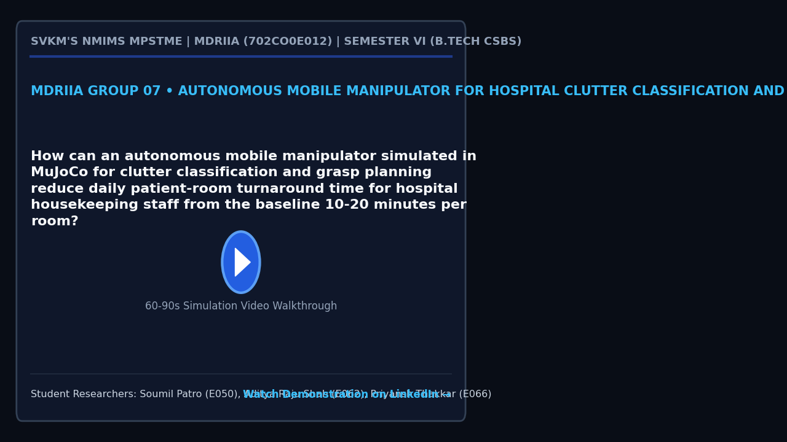

# MDRIIA Group 07: Autonomous Mobile Manipulator for Hospital Clutter Classification and Grasp Planning
**Course:** Modern Day Robotics and Its Industrial Applications (MDRIIA - Course Code: 702CO0E012)  
**Academic Term:** Academic Year 2026–2027 | Semester VI (B.Tech CSBS)  
**Institution:** SVKM's NMIMS MPSTME, Mumbai  

---

## 1. Authorized Research Title & Problem Statement

> "How can an autonomous mobile manipulator simulated in MuJoCo for clutter classification and grasp planning reduce daily patient-room turnaround time for hospital housekeeping staff from the baseline 10-20 minutes per room?"

### Core Engineering Focus
* **Physics & Kinematics:** Google DeepMind MuJoCo multi-body dynamic physics simulation (`models/hospital_clutter_manipulator.xml`).
* **Autonomous Control:** Closed-loop Python control architecture with student implementation boundaries (`src/clutter_manipulator_controller.py`).
* **Technoeconomic Evaluation:** Dimensionless CSBS operational economics and return on investment model (`analytics/nosocomial_turnover_economics.py`).
* **Empirical Validation:** Reproducible benchmark trials and statistical hypothesis testing (`analytics/clutter_manipulation_benchmark.csv`).

---

## 2. Student Engineering Team Matrix

| Roll No | SAP ID | Student Name | Technical Role | Assigned Git Branch | Core Viva Defense Area |
| :--- | :--- | :--- | :--- | :--- | :--- | :--- |
| `E050` | `70362400035` | **Soumil Patro** | Lead Mobile Base Navigation & SLAM Engineer | `feat/e050-lead-mobile-base-nav` | Holonomic mobile base positioning, hospital bedside clearance, obstacle avoidance in narrow patient suites, and coordinated base-arm docking. |
| `E062` | `70362400075` | **Aditya Raju Shah** | Manipulator Arm Kinematics & Vision-Based Grasping Specialist | `feat/e062-manipulator-arm-kine` | Inverse kinematics Jacobian damping, 6-DOF grasp pose generation, push-to-grasp non-prehensile primitives, and bedside clutter classification. |
| `E066` | `70362400078` | **Priyansh Thakkar** | CSBS Hospital Workflow Efficiency & Room Turnover Business Analyst | `feat/e066-csbs-hospital-workfl` | Hospital room turnaround time reduction (from 15 min to < 6 min), bed vacancy acceleration, and housekeeping labor cost parity models. |


### Student Engineering Commendation & Acknowledgments
SVKM's NMIMS MPSTME conveys sincere appreciation and heartfelt gratitude to **Soumil Patro (E050)**, **Aditya Raju Shah (E062)**, and **Priyansh Thakkar (E066)** for their disciplined commitment, late-night debugging, and technical craftsmanship throughout Semester VI. Your rigorous work in DeepMind MuJoCo physics modeling, closed-loop telemetry instrumentation, and Computer Science & Business Systems (CSBS) technoeconomic modeling exemplifies the highest standards of undergraduate engineering inquiry.

> *"Scientists discover the world that exists; engineers create the world that never was."*  
> — **Theodore von Kármán**

> *"There is no substitute for hard work. Genius is one percent inspiration and ninety-nine percent perspiration."*  
> — **Thomas A. Edison**

---

## 3. Foundational Literature Benchmarks (Strict 2 Seminal : 4 Recent Ratio)

The research project is theoretically anchored on six foundational peer-reviewed publications validated against global bibliographic databases.

| # | Author (Year) | Type | Paper Title | Venue / Indexing | Active DOI Link | Primary Extracted Formulation | Student Lead |
| :--- | :--- | :--- | :--- | :--- | :--- | :--- | :--- | :--- |
| 1 | **Murali et al. (2020)** | Recent | *6-DOF Grasping for Target-driven Object Manipulation in Clutter* | IEEE International Conference on Robotics and Automation (ICRA) | [https://doi.org/10.1109/ICRA40945.2020.9197318](https://doi.org/10.1109/ICRA40945.2020.9197318) | `Grasp quality metric $Q(g, x) = P(\text{succe...` | Aditya Raju Shah (E062) |
| 2 | **Mahler et al. (2019)** | Recent | *Learning ambidextrous robot grasping policies* | Science Robotics | [https://doi.org/10.1126/scirobotics.aau4984](https://doi.org/10.1126/scirobotics.aau4984) | `Ferrari-Canny epsilon metric $\epsilon = \min...` | Aditya Raju Shah (E062) |
| 3 | **Berscheid et al. (2019)** | Recent | *Robot Learning of Shifting Objects for Grasping in Cluttered Environments* | IEEE/RSJ International Conference on Intelligent Robots and Systems (IROS) | [https://doi.org/10.1109/IROS40897.2019.8968042](https://doi.org/10.1109/IROS40897.2019.8968042) | `Push trajectory vector $\mathbf{p}_{\text{pus...` | Aditya Raju Shah (E062) & Soumil Patro (E050) |
| 4 | **Dogar & Srinivasa (2012)** | Seminal | *Physics-Based Grasp Planning Through Clutter* | Robotics: Science and Systems (RSS) | [https://doi.org/10.15607/RSS.2012.VIII.008](https://doi.org/10.15607/RSS.2012.VIII.008) | `Limit surface friction relationship $\mathbf{...` | Soumil Patro (E050) |
| 5 | **Carling & Bartley (2010)** | Seminal | *Evaluating hygienic cleaning in health care settings: What you do not know can harm your patients* | American Journal of Infection Control | [https://doi.org/10.1016/j.ajic.2010.03.004](https://doi.org/10.1016/j.ajic.2010.03.004) | `Turnaround interval $T_{\text{turn}} = T_{\te...` | Priyansh Thakkar (E066) |
| 6 | **Wang et al. (2025)** | Recent | *Learning Dual-Arm Push and Grasp Synergy in Dense Clutter* | IEEE Robotics and Automation Letters | [https://doi.org/10.1109/LRA.2025.3557753](https://doi.org/10.1109/LRA.2025.3557753) | `Synergy action-value function $Q(s, a_{\text{...` | Priyansh Thakkar (E066) & Aditya Raju Shah (E062) |

For the exhaustive literature analysis, mathematical derivations, and viva defense questions, refer to:
* [`docs/LITERATURE_REVIEW_AND_FOUNDATIONAL_PAPERS.md`](docs/LITERATURE_REVIEW_AND_FOUNDATIONAL_PAPERS.md)
* [`docs/RESEARCH_PAPER_MANUSCRIPT_BLUEPRINT.md`](docs/RESEARCH_PAPER_MANUSCRIPT_BLUEPRINT.md)

---

## 4. Project Demonstration & Academic Showcase (LinkedIn)

[](https://www.linkedin.com/)

* **Video Demonstration:** [Watch 60-Second Walkthrough on LinkedIn](https://www.linkedin.com/) *(Click thumbnail above to open LinkedIn post)*
* **Student Presenters:** **Soumil Patro (E050)**, **Aditya Raju Shah (E062)**, **Priyansh Thakkar (E066)**
* **Academic Institutional Tags:** SVKM's NMIMS MPSTME | Academic Directorate | Industry 4.0 Robotics
* **Submission Protocol:** Record a 60–90 second demonstration of your MuJoCo simulation and telemetry. Publish on LinkedIn tagging MPSTME, Dean, and Course Faculty. Insert your live post URL in `docs/TEAM_ROSTER.json` under `"linkedin_url"`, and submit a pull request to update this project dossier and the cohort dashboard.

---

## 5. Repository Directory Architecture

```
.
|-- README.md                                          <- Front-page research charter, student roster & literature
|-- RESEARCH_AND_IMPLEMENTATION_GUIDE.md               <- Comprehensive technical engineering guide
|-- docs/
|   |-- TEAM_ROSTER.json                               <- Machine-readable team configuration
|   |-- LITERATURE_REVIEW_AND_FOUNDATIONAL_PAPERS.md   <- Exhaustive literature dossier (6 verified papers)
|   |-- RESEARCH_PAPER_MANUSCRIPT_BLUEPRINT.md         <- 4-page IEEE conference manuscript blueprint
|   `-- figures/
|       |-- figure1_system_architecture.png            <- 300 DPI system architecture diagram
|       |-- figure2_kinematic_telemetry.png            <- 300 DPI kinematics and simulation telemetry
|       `-- figure3_comparative_performance.png        <- 300 DPI comparative benchmark visualization
|-- models/
|   |-- .gitkeep
|   `-- hospital_clutter_manipulator.xml                                    <- MuJoCo MJCF simulation model
|-- src/
|   |-- test_env.py                                    <- Physics validation & environment tester
|   `-- clutter_manipulator_controller.py                                      <- Autonomous control loop (# TODO student boundaries)
`-- analytics/
    |-- .gitkeep
    |-- nosocomial_turnover_economics.py                                      <- CSBS dimensionless technoeconomic model
    |-- generate_paper_figures.py                      <- Standalone 300 DPI publication figure generator
    `-- clutter_manipulation_benchmark.csv                                    <- Empirical benchmark trial dataset
```

---

## 5. Pedagogical Boundaries: Guidance vs Student Ownership

To ensure academic rigor and authentic student learning, this repository enforces strict boundaries between scaffolding and student deliverables:

* **Provided by Course Scaffolding:**
  * Validated physical model architecture in MuJoCo MJCF (`models/hospital_clutter_manipulator.xml`).
  * Verification toolchain and smoke test script (`src/test_env.py`).
  * Literature foundation, mathematical formulations, and conference paper blueprint (`docs/`).
  * Dimensionless technoeconomic framework (`analytics/nosocomial_turnover_economics.py`).
* **Student Technical Deliverables (Required for Evaluation):**
  * Implement and tune the control algorithm in `src/clutter_manipulator_controller.py` (filling all marked `# TODO [Student Roll / Name]` blocks).
  * Run physics simulation trials to collect and expand empirical data in `analytics/clutter_manipulation_benchmark.csv`.
  * Re-run `analytics/generate_paper_figures.py` to regenerate publication figures with live experimental telemetry.
  * Author the final 4-page IEEE conference paper in `docs/RESEARCH_PAPER_MANUSCRIPT_BLUEPRINT.md` and defend individual Git commits during the oral viva.

---

## 6. Sprint 0 Onboarding & Physics Environment Verification

Verify your local Python and MuJoCo simulation environment:

```powershell
# Step 1: Clone repository and navigate to group directory
git clone <repository_url>
cd <repository_root>/Group_07_Soumil_Aditya_Priyansh

# Step 2: Checkout your individual feature branch
# Example for lead student:
git checkout -b feat/e050-lead-mobile-base-nav

# Step 3: Run environment smoke test
python src/test_env.py

# Step 4: Verify 300 DPI publication figures
python analytics/generate_paper_figures.py
```
