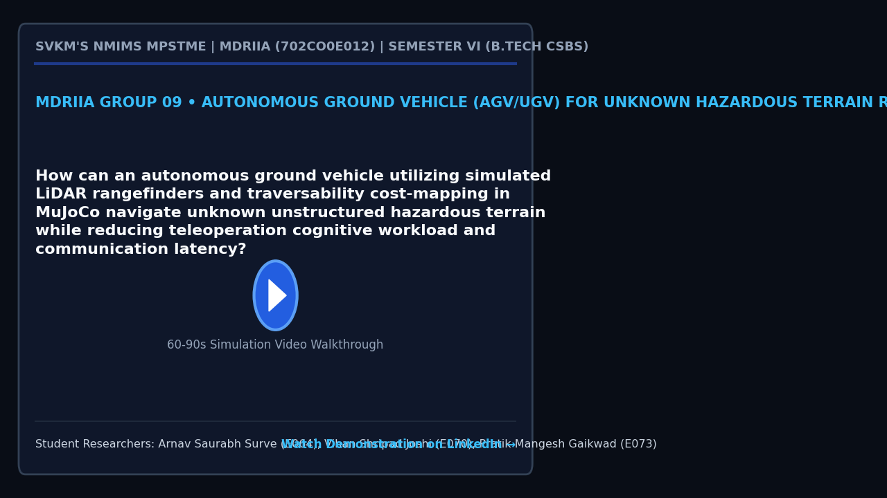

# MDRIIA Group 09: Autonomous Ground Vehicle (AGV/UGV) for Unknown Hazardous Terrain Reconnaissance
**Course:** Modern Day Robotics and Its Industrial Applications (MDRIIA - Course Code: 702CO0E012)  
**Academic Term:** Academic Year 2026–2027 | Semester VI (B.Tech CSBS)  
**Institution:** SVKM's NMIMS MPSTME, Mumbai  

---

## 1. Authorized Research Title & Problem Statement

> "How can an autonomous ground vehicle utilizing simulated LiDAR rangefinders and traversability cost-mapping in MuJoCo navigate unknown unstructured hazardous terrain while reducing teleoperation cognitive workload and communication latency?"

### Core Engineering Focus
* **Physics & Kinematics:** Google DeepMind MuJoCo multi-body dynamic physics simulation (`models/hazardous_terrain_ugv.xml`).
* **Autonomous Control:** Closed-loop Python control architecture with student implementation boundaries (`src/rough_terrain_recon_controller.py`).
* **Technoeconomic Evaluation:** Dimensionless CSBS operational economics and return on investment model (`analytics/hazardous_recon_economics.py`).
* **Empirical Validation:** Reproducible benchmark trials and statistical hypothesis testing (`analytics/ugv_traversability_benchmark.csv`).

---

## 2. Student Engineering Team Matrix

| Roll No | SAP ID | Student Name | Technical Role | Assigned Git Branch | Core Viva Defense Area |
| :--- | :--- | :--- | :--- | :--- | :--- | :--- |
| `E064` | `70362400017` | **Arnav Saurabh Surve** | Lead UGV Skid-Steer Dynamics & MuJoCo Terrain Modeler | `feat/e064-lead-ugv-skid-steer-` | Skid-steer 4-wheel slip dynamics, rough terrain contact normal forces, pitch/roll rollover stability, and torque distribution. |
| `E070` | `70362400063` | **Vihan Shripad Joshi** | LiDAR Perception, 3D Elevation Mapping & Obstacle Segmentation Lead | `feat/e070-lidar-perception-3d-` | Multi-ray LiDAR point cloud filtering, 2.5D elevation grid mapping, slope/roughness traversability cost calculation, and path replanning. |
| `E073` | `70362400033` | **Pratik Mangesh Gaikwad** | CSBS Hazardous Operations Safety & Teleoperation Latency Analyst | `feat/e073-csbs-hazardous-opera` | Operator cognitive workload metrics (NASA-TLX), teleoperation latency resilience, human risk mitigation, and industrial inspection payback. |


### Student Engineering Commendation & Acknowledgments
SVKM's NMIMS MPSTME conveys sincere appreciation and heartfelt gratitude to **Arnav Saurabh Surve (E064)**, **Vihan Shripad Joshi (E070)**, and **Pratik Mangesh Gaikwad (E073)** for their disciplined commitment, late-night debugging, and technical craftsmanship throughout Semester VI. Your rigorous work in DeepMind MuJoCo physics modeling, closed-loop telemetry instrumentation, and Computer Science & Business Systems (CSBS) technoeconomic modeling exemplifies the highest standards of undergraduate engineering inquiry.

> *"Scientists discover the world that exists; engineers create the world that never was."*  
> — **Theodore von Kármán**

> *"There is no substitute for hard work. Genius is one percent inspiration and ninety-nine percent perspiration."*  
> — **Thomas A. Edison**

---

## 3. Foundational Literature Benchmarks (Strict 2 Seminal : 4 Recent Ratio)

The research project is theoretically anchored on six foundational peer-reviewed publications validated against global bibliographic databases.

| # | Author (Year) | Type | Paper Title | Venue / Indexing | Active DOI Link | Primary Extracted Formulation | Student Lead |
| :--- | :--- | :--- | :--- | :--- | :--- | :--- | :--- | :--- |
| 1 | **Fankhauser et al. (2018)** | Recent | *Probabilistic Terrain Mapping for Mobile Robots With Uncertain Localization* | IEEE Robotics and Automation Letters | [https://doi.org/10.1109/LRA.2018.2849506](https://doi.org/10.1109/LRA.2018.2849506) | `Terrain variance update $\sigma_h^2(x,y) = \s...` | Vihan Shripad Joshi (E070) & Arnav Saurabh Surve (E064) |
| 2 | **Chilian & Hirschmuller (2009)** | Recent | *Stereo camera based navigation of mobile robots on rough terrain* | IEEE/RSJ International Conference on Intelligent Robots and Systems (IROS) | [https://doi.org/10.1109/IROS.2009.5354535](https://doi.org/10.1109/IROS.2009.5354535) | `Roughness metric $\rho = \sqrt{\frac{1}{N} \s...` | Vihan Shripad Joshi (E070) |
| 3 | **Kelly et al. (2006)** | Seminal | *Toward Reliable Off Road Autonomous Vehicles Operating in Challenging Environments* | The International Journal of Robotics Research | [https://doi.org/10.1177/0278364906065543](https://doi.org/10.1177/0278364906065543) | `Predictive trajectory roll-out $\dot{x} = f(x...` | Arnav Saurabh Surve (E064) |
| 4 | **Chen et al. (2007)** | Recent | *Human Performance Issues and User Interface Design for Teleoperated Robots* | IEEE Transactions on Systems, Man and Cybernetics, Part C | [https://doi.org/10.1109/TSMCC.2007.905819](https://doi.org/10.1109/TSMCC.2007.905819) | `Workload index $W_{\text{NASA}} = \sum w_i S_...` | Pratik Mangesh Gaikwad (E073) |
| 5 | **Casper & Murphy (2003)** | Seminal | *Human-robot interactions during the robot-assisted urban search and rescue response at the World Trade Center* | IEEE Transactions on Systems, Man, and Cybernetics, Part B | [https://doi.org/10.1109/TSMCB.2003.811794](https://doi.org/10.1109/TSMCB.2003.811794) | `Failure rate $\lambda_{\text{fail}} = \frac{N...` | Pratik Mangesh Gaikwad (E073) & Arnav Saurabh Surve (E064) |
| 6 | **Yu et al. (2018)** | Recent | *Algorithms and experiments on routing of unmanned aerial vehicles for emergency reconnaissance* | Journal of Field Robotics | [https://doi.org/10.1002/rob.21856](https://doi.org/10.1002/rob.21856) | `Inspection coverage utility $U_{\text{cov}} =...` | Vihan Shripad Joshi (E070) & Pratik Mangesh Gaikwad (E073) |

For the exhaustive literature analysis, mathematical derivations, and viva defense questions, refer to:
* [`docs/LITERATURE_REVIEW_AND_FOUNDATIONAL_PAPERS.md`](docs/LITERATURE_REVIEW_AND_FOUNDATIONAL_PAPERS.md)
* [`docs/RESEARCH_PAPER_MANUSCRIPT_BLUEPRINT.md`](docs/RESEARCH_PAPER_MANUSCRIPT_BLUEPRINT.md)

---

## 4. Project Demonstration & Academic Showcase (LinkedIn)

[](https://www.linkedin.com/)

* **Video Demonstration:** [Watch 60-Second Walkthrough on LinkedIn](https://www.linkedin.com/) *(Click thumbnail above to open LinkedIn post)*
* **Student Presenters:** **Arnav Saurabh Surve (E064)**, **Vihan Shripad Joshi (E070)**, **Pratik Mangesh Gaikwad (E073)**
* **Academic Institutional Tags:** SVKM's NMIMS MPSTME | Academic Directorate | Industry 4.0 Robotics
* **Submission Protocol:** Record a 60–90 second demonstration of your MuJoCo simulation and telemetry. Publish on LinkedIn tagging MPSTME, Dean, and Course Faculty. Insert your live post URL in `docs/TEAM_ROSTER.json` under `"linkedin_url"`, and submit a pull request to update this project dossier and the cohort dashboard.

---

## 5. Repository Directory Architecture

```
.
|-- README.md                                          <- Front-page research charter, student roster & literature
|-- RESEARCH_AND_IMPLEMENTATION_GUIDE.md               <- Comprehensive technical engineering guide
|-- docs/
|   |-- TEAM_ROSTER.json                               <- Machine-readable team configuration
|   |-- LITERATURE_REVIEW_AND_FOUNDATIONAL_PAPERS.md   <- Exhaustive literature dossier (6 verified papers)
|   |-- RESEARCH_PAPER_MANUSCRIPT_BLUEPRINT.md         <- 4-page IEEE conference manuscript blueprint
|   `-- figures/
|       |-- figure1_system_architecture.png            <- 300 DPI system architecture diagram
|       |-- figure2_kinematic_telemetry.png            <- 300 DPI kinematics and simulation telemetry
|       `-- figure3_comparative_performance.png        <- 300 DPI comparative benchmark visualization
|-- models/
|   |-- .gitkeep
|   `-- hazardous_terrain_ugv.xml                                    <- MuJoCo MJCF simulation model
|-- src/
|   |-- test_env.py                                    <- Physics validation & environment tester
|   `-- rough_terrain_recon_controller.py                                      <- Autonomous control loop (# TODO student boundaries)
`-- analytics/
    |-- .gitkeep
    |-- hazardous_recon_economics.py                                      <- CSBS dimensionless technoeconomic model
    |-- generate_paper_figures.py                      <- Standalone 300 DPI publication figure generator
    `-- ugv_traversability_benchmark.csv                                    <- Empirical benchmark trial dataset
```

---

## 5. Pedagogical Boundaries: Guidance vs Student Ownership

To ensure academic rigor and authentic student learning, this repository enforces strict boundaries between scaffolding and student deliverables:

* **Provided by Course Scaffolding:**
  * Validated physical model architecture in MuJoCo MJCF (`models/hazardous_terrain_ugv.xml`).
  * Verification toolchain and smoke test script (`src/test_env.py`).
  * Literature foundation, mathematical formulations, and conference paper blueprint (`docs/`).
  * Dimensionless technoeconomic framework (`analytics/hazardous_recon_economics.py`).
* **Student Technical Deliverables (Required for Evaluation):**
  * Implement and tune the control algorithm in `src/rough_terrain_recon_controller.py` (filling all marked `# TODO [Student Roll / Name]` blocks).
  * Run physics simulation trials to collect and expand empirical data in `analytics/ugv_traversability_benchmark.csv`.
  * Re-run `analytics/generate_paper_figures.py` to regenerate publication figures with live experimental telemetry.
  * Author the final 4-page IEEE conference paper in `docs/RESEARCH_PAPER_MANUSCRIPT_BLUEPRINT.md` and defend individual Git commits during the oral viva.

---

## 6. Sprint 0 Onboarding & Physics Environment Verification

Verify your local Python and MuJoCo simulation environment:

```powershell
# Step 1: Clone repository and navigate to group directory
git clone <repository_url>
cd <repository_root>/Group_09_Arnav_Vihan_Pratik

# Step 2: Checkout your individual feature branch
# Example for lead student:
git checkout -b feat/e064-lead-ugv-skid-steer-

# Step 3: Run environment smoke test
python src/test_env.py

# Step 4: Verify 300 DPI publication figures
python analytics/generate_paper_figures.py
```
