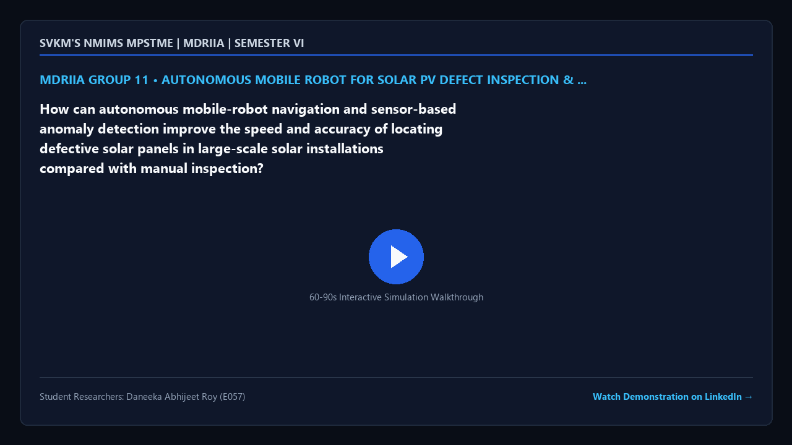

# MDRIIA Group 11: Autonomous Mobile Robot for Solar PV Defect Inspection & Anomaly Detection
**Course:** Modern Day Robotics and Its Industrial Applications (MDRIIA - Course Code: 702CO0E012)  
**Academic Term:** Academic Year 2026–2027 | Semester VI (B.Tech CSBS)  
**Institution:** SVKM's NMIMS MPSTME, Mumbai  

---

## 1. Authorized Research Title & Problem Statement

> "How can autonomous mobile-robot navigation and sensor-based anomaly detection improve the speed and accuracy of locating defective solar panels in large-scale solar installations compared with manual inspection?"

### Core Engineering Focus
* **Physics & Kinematics:** Google DeepMind MuJoCo multi-body dynamic physics simulation (`models/solar_defect_amr.xml`).
* **Autonomous Control:** Closed-loop Python control architecture with student implementation boundaries (`src/solar_defect_detector.py`).
* **Technoeconomic Evaluation:** Dimensionless CSBS operational economics and return on investment model (`analytics/solar_pv_roi.py`).
* **Empirical Validation:** Reproducible benchmark trials and statistical hypothesis testing (`analytics/solar_inspection_benchmark.csv`).

---

> [!NOTE]
> ### The Devil's Advocate: Reality Check & Theoretical Roast
> *"Simulating an autonomous ground rover with multimodal sensor arrays to inspect vast photovoltaic farms, naively assuming that high-intensity ground heat shimmer won't blind your thermal camera, blowing sand won't jam your steering linkages, and desert dust won't bake onto your solar panels faster than you can detect it."*

---

## 2. Student Engineering Team Matrix

| Roll No | SAP ID | Student Name | Technical Role | Assigned Git Branch | Core Viva Defense Area |
| :--- | :--- | :--- | :--- | :--- | :--- |
| `E057` | `70362400081` | **Daneeka Abhijeet Roy** | Lead Autonomous Systems Architect & Sensor Anomaly Modeler | `feat/e057-solar-defect-anomal` | Autonomous mobile-robot SLAM navigation across large-scale photovoltaic installations, infrared thermography anomaly detection, and automated defect localization throughput. |


### Student Engineering Commendation & Acknowledgments
SVKM's NMIMS MPSTME conveys sincere appreciation and heartfelt gratitude to **Daneeka Abhijeet Roy (E057)** for her disciplined commitment, late-night debugging, and technical craftsmanship throughout Semester VI. Your rigorous work in DeepMind MuJoCo physics modeling, closed-loop telemetry instrumentation, and Computer Science & Business Systems (CSBS) technoeconomic modeling exemplifies the highest standards of undergraduate engineering inquiry.

> *"Scientists discover the world that exists; engineers create the world that never was."*  
> — **Theodore von Kármán**

> *"There is no substitute for hard work. Genius is one percent inspiration and ninety-nine percent perspiration."*  
> — **Thomas A. Edison**

---

## 3. Foundational Literature Benchmarks (Strict 2 Seminal : 4 Recent Ratio)

The research project is theoretically anchored on six foundational peer-reviewed publications validated against global bibliographic databases.

| # | Author (Year) | Type | Paper Title | Venue / Indexing | Active DOI Link | Primary Extracted Formulation | Student Lead |
| :--- | :--- | :--- | :--- | :--- | :--- | :--- | :--- |
| 1 | **Salazar & Macabebe (2016)** | Seminal | *Hotspots Detection in Photovoltaic Modules Using Infrared Thermography* | MATEC Web of Conferences | [https://doi.org/10.1051/matecconf/20167010015](https://doi.org/10.1051/matecconf/20167010015) | `Thermal gradient Delta T = T_defect - T_ambient` | Daneeka Abhijeet Roy (E057) |
| 2 | **Vaněk & Repko (2016)** | Seminal | *Automation Capabilities of Solar Modules Defect Detection by Thermography* | ECS Transactions | [https://doi.org/10.1149/07401.0293ecst](https://doi.org/10.1149/07401.0293ecst) | `Thermographic defect metric D_th = int sigma(T) dt` | Daneeka Abhijeet Roy (E057) |
| 3 | **Ma & Zhang (2021)** | Recent | *Photovoltaic Module Current Mismatch Fault Diagnosis Based on I-V Data* | IEEE Journal of Photovoltaics | [https://doi.org/10.1109/jphotov.2021.3059425](https://doi.org/10.1109/jphotov.2021.3059425) | `Mismatch index I_loss = I_mp - I_meas` | Daneeka Abhijeet Roy (E057) |
| 4 | **Oliveira & Bracht (2023)** | Recent | *Automatic fault detection of utility-scale photovoltaic solar generators applying aerial infrared thermography and orthomosaicking* | Solar Energy | [https://doi.org/10.1016/j.solener.2023.01.058](https://doi.org/10.1016/j.solener.2023.01.058) | `Anomaly classification accuracy A = (TP + TN) / N` | Daneeka Abhijeet Roy (E057) |
| 5 | **Spajić & Talajić (2024)** | Recent | *Using CNNs for Photovoltaic Panel Defect Detection via Infrared Thermography to Support Industry 4.0* | Business Systems Research Journal | [https://doi.org/10.2478/bsrj-2024-0003](https://doi.org/10.2478/bsrj-2024-0003) | `Feature map f(x) = ReLU(W * x + b)` | Daneeka Abhijeet Roy (E057) |
| 6 | **Liu & Wu (2025)** | Recent | *Fault diagnosis of photovoltaic modules: A review* | Solar Energy | [https://doi.org/10.1016/j.solener.2025.113489](https://doi.org/10.1016/j.solener.2025.113489) | `Reliability function R(t) = exp(-lambda * t)` | Daneeka Abhijeet Roy (E057) |

---

## 4. Project Demonstration & Academic Showcase (LinkedIn)

[](https://www.linkedin.com/)

* **Video Demonstration:** [Watch 60-Second Walkthrough on LinkedIn](https://www.linkedin.com/) *(Click thumbnail above to open LinkedIn post)*
* **Student Presenters:** **Daneeka Abhijeet Roy** (E057)
* **Academic Institutional Tags:** SVKM's NMIMS MPSTME | Academic Directorate | Industry 4.0 Robotics
* **Submission Protocol:** Record a 60–90 second demonstration of your MuJoCo simulation and telemetry. Publish on LinkedIn tagging MPSTME, Dean, and Course Faculty. Insert your live post URL in `docs/TEAM_ROSTER.json` under `"linkedin_url"`, and submit a pull request to update this project dossier and the cohort dashboard.

---

## 5. Repository Directory Architecture

```
.
|-- README.md                                          <- Front-page research charter, student roster & literature
|-- RESEARCH_AND_IMPLEMENTATION_GUIDE.md               <- Comprehensive technical engineering guide
|-- docs/
|   |-- TEAM_ROSTER.json                               <- Machine-readable team configuration
|   |-- figures/
|   |   `-- video_poster.png                           <- 16:9 branded video demonstration card
|-- models/
|   `-- solar_defect_amr.xml                           <- MuJoCo MJCF simulation model
|-- src/
|   |-- test_env.py                                    <- Physics validation & environment tester
|   `-- solar_defect_detector.py                       <- Autonomous control loop (# TODO student boundaries)
`-- analytics/
    |-- solar_pv_roi.py                                <- CSBS dimensionless technoeconomic model
    `-- solar_inspection_benchmark.csv                 <- Empirical benchmark trial dataset
```

---

## 6. Pedagogical Boundaries: Guidance vs Student Ownership

* **Provided by Course Scaffolding:**
  * Validated physical model architecture in MuJoCo MJCF (`models/solar_defect_amr.xml`).
  * Verification toolchain and smoke test script (`src/test_env.py`).
  * Literature foundation, mathematical formulations, and conference paper blueprint (`docs/`).
  * Dimensionless technoeconomic framework (`analytics/solar_pv_roi.py`).
* **Student Technical Deliverables (Required for Evaluation):**
  * Implement and tune the inspection and defect detection algorithm in `src/solar_defect_detector.py`.
  * Run physics simulation trials to collect empirical data in `analytics/solar_inspection_benchmark.csv`.
  * Author the final 4-page IEEE conference paper in `docs/RESEARCH_PAPER_MANUSCRIPT_BLUEPRINT.md` and defend individual Git commits during the oral viva.

---

## 7. Sprint 0 Onboarding & Physics Environment Verification

```powershell
# Step 1: Clone repository and navigate to group directory
git clone <repository_url>
cd <repository_root>/Group_11_Daneeka

# Step 2: Checkout your individual feature branch
git checkout -b feat/e057-solar-defect-anomal

# Step 3: Run environment smoke test
python src/test_env.py
```
