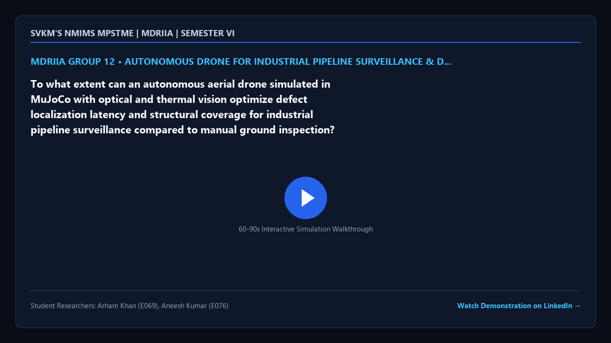

# MDRIIA Group 12: Autonomous Drone for Industrial Pipeline Surveillance & Defect Detection
**Course:** Modern Day Robotics and Its Industrial Applications (MDRIIA - Course Code: 702CO0E012)  
**Academic Term:** Academic Year 2026–2027 | Semester VI (B.Tech CSBS)  
**Institution:** SVKM's NMIMS MPSTME, Mumbai  

---

## 1. Authorized Research Title & Problem Statement

> "To what extent can an autonomous aerial drone simulated in MuJoCo with optical and thermal vision optimize defect localization latency and structural coverage for industrial pipeline surveillance compared to manual ground inspection?"

### Core Engineering Focus
* **Physics & Kinematics:** Google DeepMind MuJoCo multi-body dynamic physics simulation (`models/pipeline_surveillance_drone.xml`).
* **Autonomous Control:** Closed-loop Python control architecture with student implementation boundaries (`src/drone_pipeline_controller.py`).
* **Technoeconomic Evaluation:** Dimensionless CSBS operational economics and return on investment model (`analytics/pipeline_monitoring_roi.py`).
* **Empirical Validation:** Reproducible benchmark trials and statistical hypothesis testing (`analytics/pipeline_inspection_benchmark.csv`).

---

> [!NOTE]
> ### The Devil's Advocate: Reality Check & Theoretical Roast
> *"Deploying an autonomous aerial drone with optical and thermal vision to inspect remote oil and gas pipelines, blithely assuming that thermal plumes won't toss your quadrotor into high-pressure flare stacks, GPS multipath won't send you careening into flange valves, and pipeline acoustic noise won't deafen your onboard telemetry."*

---

## 2. Student Engineering Team Matrix

| Roll No | SAP ID | Student Name | Technical Role | Assigned Git Branch | Core Viva Defense Area |
| :--- | :--- | :--- | :--- | :--- | :--- |
| `E069` | `70362400047` | **Arham Khan** | Lead Autonomous Aerial Robotics Architect & Optical/Thermal Vision Modeler | `feat/e069-uav-pipeline-survei` | Multirotor drone aerodynamics, MuJoCo waypoint navigation along linear pipeline corridors, and real-time visual-thermal feature extraction for structural defect localization. |
| `E076` | `70362400010` | **Aneesh Kumar** | Aerial Corridor Guidance, Geo-Referencing & Pipeline Asset ROI Analyst | `feat/e076-corridor-guidance-` | Corridor guidance state machines, GPS-denied visual geo-referencing, and CSBS pipeline maintenance technoeconomic models evaluating CapEx/OpEx payback without fiat currency. |

### Student Engineering Commendation & Acknowledgments
SVKM's NMIMS MPSTME conveys sincere appreciation and heartfelt gratitude to **Arham Khan (E069)** and **Aneesh Kumar (E076)** for their disciplined commitment, late-night debugging, and technical craftsmanship throughout Semester VI. Your rigorous work in DeepMind MuJoCo physics modeling, closed-loop telemetry instrumentation, and Computer Science & Business Systems (CSBS) technoeconomic modeling exemplifies the highest standards of undergraduate engineering inquiry.

> *"Scientists discover the world that exists; engineers create the world that never was."*  
> — **Theodore von Kármán**

> *"There is no substitute for hard work. Genius is one percent inspiration and ninety-nine percent perspiration."*  
> — **Thomas A. Edison**

---

## 3. Foundational Literature Benchmarks (Strict 2 Seminal : 4 Recent Ratio)

The research project is theoretically anchored on six foundational peer-reviewed publications validated against global bibliographic databases.

| # | Author (Year) | Type | Paper Title | Venue / Indexing | Active DOI Link | Primary Extracted Formulation | Student Lead |
| :--- | :--- | :--- | :--- | :--- | :--- | :--- | :--- |
| 1 | **Stokkeland, Klausen, & Johansen (2015)** | Seminal | *Autonomous visual navigation of Unmanned Aerial Vehicle for infrastructure inspection* | 2015 ICUAS | [https://doi.org/10.1109/icuas.2015.7152389](https://doi.org/10.1109/icuas.2015.7152389) | `Corridor tracking error e_y = y_uav - y_pipe` | Arham Khan (E069) |
| 2 | **Hui & Bian (2018)** | Seminal | *Vision-based autonomous navigation approach for unmanned aerial vehicle transmission-line inspection* | Int. J. Adv. Robotic Systems | [https://doi.org/10.1177/1729881417752821](https://doi.org/10.1177/1729881417752821) | `Line orientation theta = arctan2(dy, dx)` | Arham Khan (E069) & Aneesh Kumar (E076) |
| 3 | **Car & Markovic (2020)** | Recent | *Autonomous Wind-Turbine Blade Inspection Using LiDAR-Equipped Unmanned Aerial Vehicle* | IEEE Access | [https://doi.org/10.1109/access.2020.3009738](https://doi.org/10.1109/access.2020.3009738) | `Point cloud distance d = min ||p_uav - p_surface||` | Arham Khan (E069) |
| 4 | **Okoli & Ubochi (2022)** | Recent | *Autonomous Robot for Gas Pipeline Inspection and Leak Detection* | Int. J. Computing and Digital Systems | [https://doi.org/10.12785/ijcds/110166](https://doi.org/10.12785/ijcds/110166) | `Gas dispersion model C(x, y, z)` | Aneesh Kumar (E076) |
| 5 | **Shadrenkin & Tokarev (2023)** | Recent | *Automated Pipeline Inspection Using Unmanned Aerial Vehicles* | Problems of Gathering Treatment & Transp. | [https://doi.org/10.17122/ntj-oil-2023-3-103-115](https://doi.org/10.17122/ntj-oil-2023-3-103-115) | `Inspection throughput eta = L_inspected / t_flight` | Aneesh Kumar (E076) & Arham Khan (E069) |
| 6 | **Bretschneider & Bollmann (2024)** | Recent | *Concepts for drone based pipeline leak detection* | Frontiers in Robotics and AI | [https://doi.org/10.3390/frobt.2024.1426206](https://doi.org/10.3389/frobt.2024.1426206) | `Thermal leak anomaly Delta T_leak = T_soil - T_pipe` | Aneesh Kumar (E076) |

---

## 4. Project Demonstration & Academic Showcase (LinkedIn)

[](https://www.linkedin.com/)

* **Video Demonstration:** [Watch 60-Second Walkthrough on LinkedIn](https://www.linkedin.com/) *(Click thumbnail above to open LinkedIn post)*
* **Student Presenters:** **Arham Khan** (E069), **Aneesh Kumar** (E076)
* **Academic Institutional Tags:** SVKM's NMIMS MPSTME | Academic Directorate | Industry 4.0 Robotics
* **Submission Protocol:** Record a 60–90 second demonstration of your MuJoCo simulation and telemetry. Publish on LinkedIn tagging MPSTME, Dean, and Course Faculty. Insert your live post URL in `docs/TEAM_ROSTER.json` under `"linkedin_url"`, and submit a pull request to update this project dossier and the cohort dashboard.

---

## 5. Repository Directory Architecture

```
.
|-- README.md                                          <- Front-page research charter, student roster & literature
|-- RESEARCH_AND_IMPLEMENTATION_GUIDE.md               <- Comprehensive technical engineering guide
|-- docs/
|   |-- TEAM_ROSTER.json                               <- Machine-readable team configuration
|   |-- figures/
|   |   `-- video_poster.png                           <- 16:9 branded video demonstration card
|   |-- LITERATURE_REVIEW_AND_FOUNDATIONAL_PAPERS.md   <- Literature review & active DOIs
|   `-- RESEARCH_PAPER_MANUSCRIPT_BLUEPRINT.md         <- 4-page IEEE draft blueprint
|-- models/
|   `-- pipeline_surveillance_drone.xml                <- MuJoCo MJCF simulation model
|-- src/
|   |-- test_env.py                                    <- Physics validation & environment tester
|   `-- drone_pipeline_controller.py                   <- Autonomous control loop (# TODO student boundaries)
`-- analytics/
    |-- pipeline_monitoring_roi.py                     <- CSBS dimensionless technoeconomic model
    |-- generate_paper_figures.py                      <- 300 DPI publication figure generator
    `-- pipeline_inspection_benchmark.csv              <- Empirical benchmark trial dataset
```

---

## 6. Pedagogical Boundaries: Guidance vs Student Ownership

* **Provided by Course Scaffolding:**
  * Validated physical model architecture in MuJoCo MJCF (`models/pipeline_surveillance_drone.xml`).
  * Verification toolchain and smoke test script (`src/test_env.py`).
  * Literature foundation, mathematical formulations, and conference paper blueprint (`docs/`).
  * Dimensionless technoeconomic framework (`analytics/pipeline_monitoring_roi.py`).
* **Student Technical Deliverables (Required for Evaluation):**
  * Implement and tune the aerial corridor navigation and pipeline inspection algorithm in `src/drone_pipeline_controller.py`.
  * Run physics simulation trials to collect empirical data in `analytics/pipeline_inspection_benchmark.csv`.
  * Author the final 4-page IEEE conference paper in `docs/RESEARCH_PAPER_MANUSCRIPT_BLUEPRINT.md` and defend individual Git commits during the oral viva.

---

## 7. Sprint 0 Onboarding & Physics Environment Verification

```powershell
# Step 1: Clone repository and navigate to group directory
git clone <repository_url>
cd <repository_root>/Group_12_Arham_Aneesh

# Step 2: Checkout your individual feature branch
git checkout -b feat/e069-uav-pipeline-survei

# Step 3: Run environment smoke test
python src/test_env.py
```
